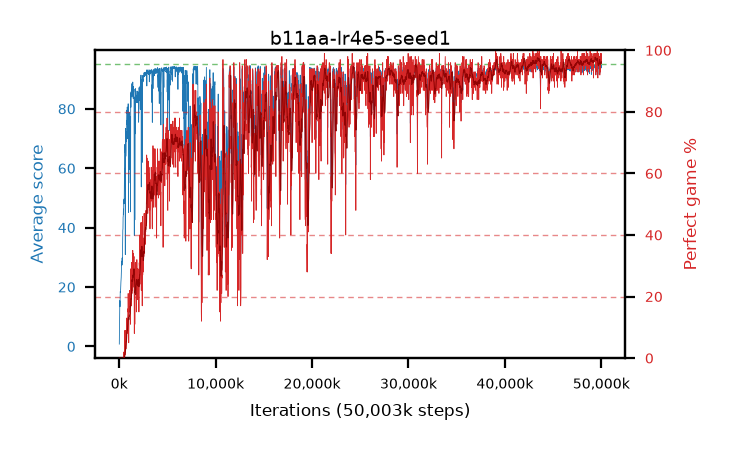

# b11aa-lr4e5-seed1

step **50,003,968** · 3052 evals · trailing **93.81** · peak **93.99** @43,466,752 · sef **65.2** · best30 **97.0** @49,577,984

## Config

| | |
|---|---|
| algo | ppo |
| collect_envs | 128 |
| discount | 0.99 |
| eval_interval | 16384 |
| eval_queue | True |
| eval_queue_depth | 16 |
| eval_workers | 8 |
| fc_layers | (320,) |
| graph_eval_episodes | 100 |
| max_steps | 50003968 |
| min_checkpoint_score | 40.0 |
| ppo_adam_epsilon | 1e-07 |
| ppo_clip | 0.2 |
| ppo_clip_final | None |
| ppo_entropy_coef | 0.01 |
| ppo_entropy_coef_final | None |
| ppo_epochs | 4 |
| ppo_gae_lambda | 0.99 |
| ppo_gradient_clipping | 0.5 |
| ppo_horizon | 50.3 |
| ppo_learning_rate | 4e-05 |
| ppo_learning_rate_final | None |
| ppo_minibatch | 256 |
| ppo_normalize_adv | True |
| ppo_rollout | 128 |
| ppo_target_kl | 0.0 |
| ppo_transitions_per_rollout | 16384 |
| ppo_value_loss | huber |
| ppo_vf_coef | 0.5 |
| seed | 1 |
| torch_threads | 1 |

## Evals

| step | avg score | trailing avg | min score | max score | avg reward | perfect % | epsilon |
|---|---|---|---|---|---|---|---|
| 16384 | 0.78 | 0.78 | 0.0 | 4.0 | 0.28 | 0.0 |  |
| 32768 | 6.39 | 3.58 | 1.0 | 27.0 | 4.09 | 0.0 |  |
| 49152 | 13.77 | 8.58 | 2.0 | 32.0 | 8.77 | 0.0 |  |
| ... | ... | ... | ... | ... | ... | ... | ... |
| 49823744 | 94.21 | 93.82 | 55.0 | 95.0 | 190.225 | 97.0 |  |
| 49840128 | 91.94 | 93.82 | 16.0 | 95.0 | 182.98 | 92.0 |  |
| 49856512 | 92.94 | 93.79 | 53.0 | 95.0 | 183.98 | 92.0 |  |
| 49872896 | 93.84 | 93.77 | 58.0 | 95.0 | 188.86 | 96.0 |  |
| 49889280 | 94.39 | 93.77 | 54.0 | 95.0 | 191.4 | 98.0 |  |
| 49905664 | 93.14 | 93.71 | 57.0 | 95.0 | 185.175 | 93.0 |  |
| 49922048 | 94.58 | 93.75 | 53.0 | 95.0 | 192.585 | 99.0 |  |
| 49938432 | 94.04 | 93.73 | 58.0 | 95.0 | 189.015 | 96.0 |  |
| 49954816 | 94.59 | 93.72 | 66.0 | 95.0 | 191.6 | 98.0 |  |
| 49971200 | 93.82 | 93.81 | 47.0 | 95.0 | 188.84 | 96.0 |  |
| 49987584 | 94.68 | 93.91 | 63.0 | 95.0 | 192.685 | 99.0 |  |
| 50003968 | 93.85 | 93.81 | 55.0 | 95.0 | 188.87 | 96.0 |  |
