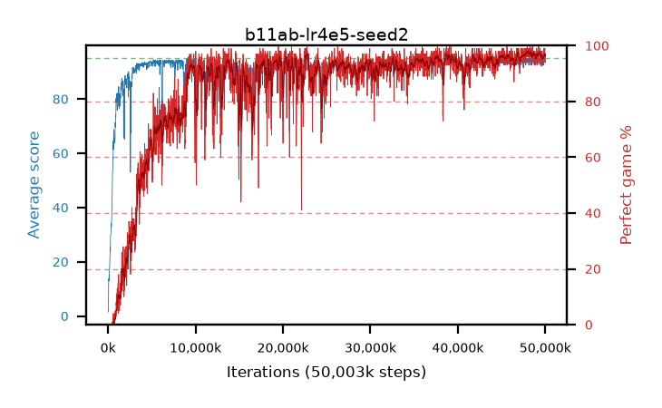

# b11ab-lr4e5-seed2

step **50,003,968** · 3052 evals · trailing **93.75** · peak **94.33** @48,103,424 · sef **78.9** · best30 **97.6** @48,103,424

## Config

| | |
|---|---|
| algo | ppo |
| collect_envs | 128 |
| discount | 0.99 |
| eval_interval | 16384 |
| eval_queue | True |
| eval_queue_depth | 16 |
| eval_workers | 8 |
| fc_layers | (320,) |
| graph_eval_episodes | 100 |
| max_steps | 50003968 |
| min_checkpoint_score | 40.0 |
| ppo_adam_epsilon | 1e-07 |
| ppo_clip | 0.2 |
| ppo_clip_final | None |
| ppo_entropy_coef | 0.01 |
| ppo_entropy_coef_final | None |
| ppo_epochs | 4 |
| ppo_gae_lambda | 0.99 |
| ppo_gradient_clipping | 0.5 |
| ppo_horizon | 50.3 |
| ppo_learning_rate | 4e-05 |
| ppo_learning_rate_final | None |
| ppo_minibatch | 256 |
| ppo_normalize_adv | True |
| ppo_rollout | 128 |
| ppo_target_kl | 0.0 |
| ppo_transitions_per_rollout | 16384 |
| ppo_value_loss | huber |
| ppo_vf_coef | 0.5 |
| seed | 2 |
| torch_threads | 1 |

## Evals

| step | avg score | trailing avg | min score | max score | avg reward | perfect % | epsilon |
|---|---|---|---|---|---|---|---|
| 16384 | 1.69 | 1.69 | 0.0 | 7.0 | 1.145 | 0.0 |  |
| 32768 | 1.49 | 1.59 | 0.0 | 6.0 | 0.99 | 0.0 |  |
| 49152 | 7.41 | 3.53 | 1.0 | 20.0 | 3.04 | 0.0 |  |
| ... | ... | ... | ... | ... | ... | ... | ... |
| 49823744 | 94.23 | 93.71 | 52.0 | 95.0 | 191.24 | 98.0 |  |
| 49840128 | 94.88 | 93.78 | 83.0 | 95.0 | 192.885 | 99.0 |  |
| 49856512 | 93.58 | 93.78 | 52.0 | 95.0 | 188.6 | 96.0 |  |
| 49872896 | 93.6 | 93.76 | 55.0 | 95.0 | 187.625 | 95.0 |  |
| 49889280 | 94.04 | 93.73 | 51.0 | 95.0 | 190.055 | 97.0 |  |
| 49905664 | 94.18 | 93.8 | 54.0 | 95.0 | 190.195 | 97.0 |  |
| 49922048 | 93.9 | 93.69 | 55.0 | 95.0 | 188.92 | 96.0 |  |
| 49938432 | 94.77 | 93.68 | 72.0 | 95.0 | 192.775 | 99.0 |  |
| 49954816 | 93.71 | 93.61 | 53.0 | 95.0 | 188.73 | 96.0 |  |
| 49971200 | 94.31 | 93.76 | 58.0 | 95.0 | 190.325 | 97.0 |  |
| 49987584 | 93.37 | 93.78 | 6.0 | 95.0 | 188.39 | 96.0 |  |
| 50003968 | 94.05 | 93.75 | 51.0 | 95.0 | 188.075 | 95.0 |  |
