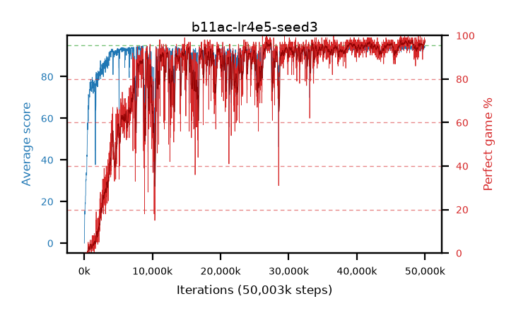

# b11ac-lr4e5-seed3

step **50,003,968** · 3052 evals · trailing **93.73** · peak **94.09** @47,185,920 · sef **74.1** · best30 **97.1** @47,284,224

## Config

| | |
|---|---|
| algo | ppo |
| collect_envs | 128 |
| discount | 0.99 |
| eval_interval | 16384 |
| eval_queue | True |
| eval_queue_depth | 16 |
| eval_workers | 8 |
| fc_layers | (320,) |
| graph_eval_episodes | 100 |
| max_steps | 50003968 |
| min_checkpoint_score | 40.0 |
| ppo_adam_epsilon | 1e-07 |
| ppo_clip | 0.2 |
| ppo_clip_final | None |
| ppo_entropy_coef | 0.01 |
| ppo_entropy_coef_final | None |
| ppo_epochs | 4 |
| ppo_gae_lambda | 0.99 |
| ppo_gradient_clipping | 0.5 |
| ppo_horizon | 50.3 |
| ppo_learning_rate | 4e-05 |
| ppo_learning_rate_final | None |
| ppo_minibatch | 256 |
| ppo_normalize_adv | True |
| ppo_rollout | 128 |
| ppo_target_kl | 0.0 |
| ppo_transitions_per_rollout | 16384 |
| ppo_value_loss | huber |
| ppo_vf_coef | 0.5 |
| seed | 3 |
| torch_threads | 1 |

## Evals

| step | avg score | trailing avg | min score | max score | avg reward | perfect % | epsilon |
|---|---|---|---|---|---|---|---|
| 16384 | 0.0 | 0.0 | 0.0 | 0.0 | -4.325 | 0.0 |  |
| 32768 | 3.67 | 1.83 | 0.0 | 11.0 | 0.92 | 0.0 |  |
| 49152 | 9.1 | 4.26 | 1.0 | 26.0 | 4.19 | 0.0 |  |
| ... | ... | ... | ... | ... | ... | ... | ... |
| 49823744 | 93.04 | 93.6 | 54.0 | 95.0 | 186.07 | 94.0 |  |
| 49840128 | 94.1 | 93.6 | 61.0 | 95.0 | 189.12 | 96.0 |  |
| 49856512 | 93.87 | 93.6 | 55.0 | 95.0 | 188.89 | 96.0 |  |
| 49872896 | 94.21 | 93.66 | 62.0 | 95.0 | 190.225 | 97.0 |  |
| 49889280 | 93.81 | 93.61 | 56.0 | 95.0 | 188.83 | 96.0 |  |
| 49905664 | 94.18 | 93.6 | 56.0 | 95.0 | 190.195 | 97.0 |  |
| 49922048 | 94.74 | 93.7 | 69.0 | 95.0 | 192.745 | 99.0 |  |
| 49938432 | 94.02 | 93.71 | 59.0 | 95.0 | 190.035 | 97.0 |  |
| 49954816 | 94.39 | 93.67 | 44.0 | 95.0 | 191.4 | 98.0 |  |
| 49971200 | 94.26 | 93.74 | 64.0 | 95.0 | 190.275 | 97.0 |  |
| 49987584 | 94.3 | 93.69 | 53.0 | 95.0 | 191.31 | 98.0 |  |
| 50003968 | 94.36 | 93.73 | 55.0 | 95.0 | 191.37 | 98.0 |  |
