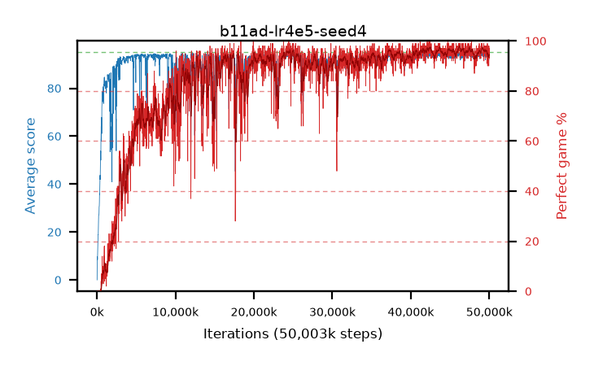

# b11ad-lr4e5-seed4

step **50,003,968** · 3052 evals · trailing **93.39** · peak **94.05** @42,450,944 · sef **75.5** · best30 **97.0** @42,516,480

## Config

| | |
|---|---|
| algo | ppo |
| collect_envs | 128 |
| discount | 0.99 |
| eval_interval | 16384 |
| eval_queue | True |
| eval_queue_depth | 16 |
| eval_workers | 8 |
| fc_layers | (320,) |
| graph_eval_episodes | 100 |
| max_steps | 50003968 |
| min_checkpoint_score | 40.0 |
| ppo_adam_epsilon | 1e-07 |
| ppo_clip | 0.2 |
| ppo_clip_final | None |
| ppo_entropy_coef | 0.01 |
| ppo_entropy_coef_final | None |
| ppo_epochs | 4 |
| ppo_gae_lambda | 0.99 |
| ppo_gradient_clipping | 0.5 |
| ppo_horizon | 50.3 |
| ppo_learning_rate | 4e-05 |
| ppo_learning_rate_final | None |
| ppo_minibatch | 256 |
| ppo_normalize_adv | True |
| ppo_rollout | 128 |
| ppo_target_kl | 0.0 |
| ppo_transitions_per_rollout | 16384 |
| ppo_value_loss | huber |
| ppo_vf_coef | 0.5 |
| seed | 4 |
| torch_threads | 1 |

## Evals

| step | avg score | trailing avg | min score | max score | avg reward | perfect % | epsilon |
|---|---|---|---|---|---|---|---|
| 16384 | 0.02 | 0.02 | 0.0 | 1.0 | -0.525 | 0.0 |  |
| 32768 | 8.34 | 4.18 | 2.0 | 18.0 | 3.34 | 0.0 |  |
| 49152 | 9.65 | 6.0 | 4.0 | 24.0 | 4.65 | 0.0 |  |
| ... | ... | ... | ... | ... | ... | ... | ... |
| 49823744 | 93.7 | 93.63 | 44.0 | 95.0 | 189.715 | 97.0 |  |
| 49840128 | 91.98 | 93.54 | 50.0 | 95.0 | 182.025 | 91.0 |  |
| 49856512 | 92.53 | 93.43 | 10.0 | 95.0 | 185.56 | 94.0 |  |
| 49872896 | 93.28 | 93.42 | 12.0 | 95.0 | 188.3 | 96.0 |  |
| 49889280 | 92.4 | 93.47 | 57.0 | 95.0 | 183.44 | 92.0 |  |
| 49905664 | 94.71 | 93.45 | 69.0 | 95.0 | 191.72 | 98.0 |  |
| 49922048 | 92.63 | 93.42 | 56.0 | 95.0 | 183.67 | 92.0 |  |
| 49938432 | 91.73 | 93.35 | 52.0 | 95.0 | 180.78 | 90.0 |  |
| 49954816 | 94.7 | 93.32 | 68.0 | 95.0 | 191.665 | 98.0 |  |
| 49971200 | 92.76 | 93.3 | 49.0 | 95.0 | 184.795 | 93.0 |  |
| 49987584 | 94.01 | 93.39 | 55.0 | 95.0 | 190.025 | 97.0 |  |
| 50003968 | 93.86 | 93.39 | 41.0 | 95.0 | 189.875 | 97.0 |  |
