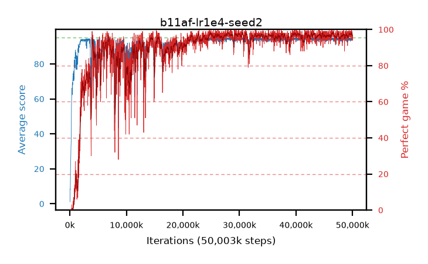

# b11af-lr1e4-seed2

step **50,003,968** · 3052 evals · trailing **94.18** · peak **94.46** @39,878,656 · sef **87.3** · best30 **97.8** @46,612,480

## Config

| | |
|---|---|
| algo | ppo |
| collect_envs | 128 |
| discount | 0.99 |
| eval_interval | 16384 |
| eval_queue | True |
| eval_queue_depth | 16 |
| eval_workers | 8 |
| fc_layers | (320,) |
| graph_eval_episodes | 100 |
| max_steps | 50003968 |
| min_checkpoint_score | 40.0 |
| ppo_adam_epsilon | 1e-07 |
| ppo_clip | 0.2 |
| ppo_clip_final | None |
| ppo_entropy_coef | 0.01 |
| ppo_entropy_coef_final | None |
| ppo_epochs | 4 |
| ppo_gae_lambda | 0.99 |
| ppo_gradient_clipping | 0.5 |
| ppo_horizon | 50.3 |
| ppo_learning_rate | 0.0001 |
| ppo_learning_rate_final | None |
| ppo_minibatch | 256 |
| ppo_normalize_adv | True |
| ppo_rollout | 128 |
| ppo_target_kl | 0.0 |
| ppo_transitions_per_rollout | 16384 |
| ppo_value_loss | huber |
| ppo_vf_coef | 0.5 |
| seed | 2 |
| torch_threads | 1 |

## Evals

| step | avg score | trailing avg | min score | max score | avg reward | perfect % | epsilon |
|---|---|---|---|---|---|---|---|
| 16384 | 1.08 | 1.08 | 0.0 | 6.0 | -0.32 | 0.0 |  |
| 32768 | 8.46 | 4.77 | 2.0 | 16.0 | 3.46 | 0.0 |  |
| 49152 | 7.98 | 6.39 | 2.0 | 21.0 | 2.98 | 0.0 |  |
| ... | ... | ... | ... | ... | ... | ... | ... |
| 49823744 | 95.0 | 94.3 | 95.0 | 95.0 | 194.0 | 100.0 |  |
| 49840128 | 93.37 | 94.12 | 24.0 | 95.0 | 187.35 | 95.0 |  |
| 49856512 | 94.96 | 94.13 | 93.0 | 95.0 | 191.97 | 98.0 |  |
| 49872896 | 93.88 | 94.15 | 8.0 | 95.0 | 190.89 | 98.0 |  |
| 49889280 | 94.97 | 94.19 | 92.0 | 95.0 | 192.975 | 99.0 |  |
| 49905664 | 94.67 | 94.14 | 68.0 | 95.0 | 191.68 | 98.0 |  |
| 49922048 | 94.47 | 94.19 | 65.0 | 95.0 | 189.49 | 96.0 |  |
| 49938432 | 94.45 | 94.21 | 60.0 | 95.0 | 189.47 | 96.0 |  |
| 49954816 | 93.8 | 94.22 | 63.0 | 95.0 | 186.83 | 94.0 |  |
| 49971200 | 94.63 | 94.25 | 80.0 | 95.0 | 190.645 | 97.0 |  |
| 49987584 | 94.19 | 94.16 | 61.0 | 95.0 | 189.21 | 96.0 |  |
| 50003968 | 94.05 | 94.18 | 62.0 | 95.0 | 187.08 | 94.0 |  |
