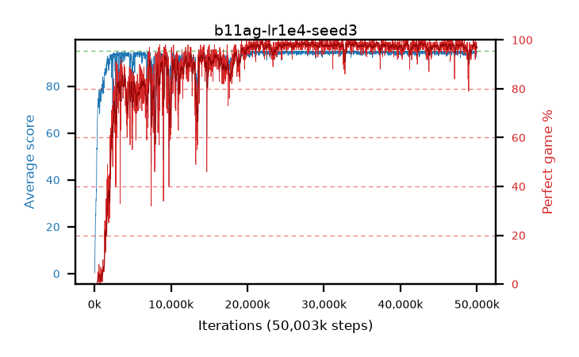

# b11ag-lr1e4-seed3

step **50,003,968** · 3052 evals · trailing **94.28** · peak **94.61** @31,916,032 · sef **87.7** · best30 **98.6** @22,036,480

## Config

| | |
|---|---|
| algo | ppo |
| collect_envs | 128 |
| discount | 0.99 |
| eval_interval | 16384 |
| eval_queue | True |
| eval_queue_depth | 16 |
| eval_workers | 8 |
| fc_layers | (320,) |
| graph_eval_episodes | 100 |
| max_steps | 50003968 |
| min_checkpoint_score | 40.0 |
| ppo_adam_epsilon | 1e-07 |
| ppo_clip | 0.2 |
| ppo_clip_final | None |
| ppo_entropy_coef | 0.01 |
| ppo_entropy_coef_final | None |
| ppo_epochs | 4 |
| ppo_gae_lambda | 0.99 |
| ppo_gradient_clipping | 0.5 |
| ppo_horizon | 50.3 |
| ppo_learning_rate | 0.0001 |
| ppo_learning_rate_final | None |
| ppo_minibatch | 256 |
| ppo_normalize_adv | True |
| ppo_rollout | 128 |
| ppo_target_kl | 0.0 |
| ppo_transitions_per_rollout | 16384 |
| ppo_value_loss | huber |
| ppo_vf_coef | 0.5 |
| seed | 3 |
| torch_threads | 1 |

## Evals

| step | avg score | trailing avg | min score | max score | avg reward | perfect % | epsilon |
|---|---|---|---|---|---|---|---|
| 16384 | 0.28 | 0.28 | 0.0 | 1.0 | -0.22 | 0.0 |  |
| 32768 | 1.58 | 0.93 | 1.0 | 7.0 | -0.405 | 0.0 |  |
| 49152 | 7.68 | 3.18 | 0.0 | 23.0 | 3.175 | 0.0 |  |
| ... | ... | ... | ... | ... | ... | ... | ... |
| 49823744 | 94.41 | 94.31 | 63.0 | 95.0 | 191.42 | 98.0 |  |
| 49840128 | 94.63 | 94.32 | 58.0 | 95.0 | 192.635 | 99.0 |  |
| 49856512 | 93.36 | 94.29 | 36.0 | 95.0 | 187.385 | 95.0 |  |
| 49872896 | 94.79 | 94.3 | 81.0 | 95.0 | 191.8 | 98.0 |  |
| 49889280 | 92.43 | 94.28 | 10.0 | 95.0 | 185.46 | 94.0 |  |
| 49905664 | 93.54 | 94.25 | 26.0 | 95.0 | 189.555 | 97.0 |  |
| 49922048 | 93.49 | 94.27 | 53.0 | 95.0 | 186.52 | 94.0 |  |
| 49938432 | 94.86 | 94.27 | 81.0 | 95.0 | 192.865 | 99.0 |  |
| 49954816 | 94.96 | 94.31 | 91.0 | 95.0 | 192.965 | 99.0 |  |
| 49971200 | 94.26 | 94.3 | 56.0 | 95.0 | 190.275 | 97.0 |  |
| 49987584 | 94.32 | 94.3 | 60.0 | 95.0 | 190.335 | 97.0 |  |
| 50003968 | 94.3 | 94.28 | 58.0 | 95.0 | 190.315 | 97.0 |  |
