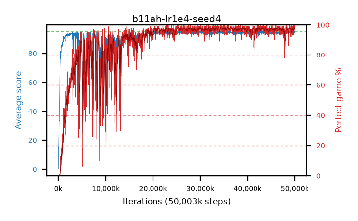

# b11ah-lr1e4-seed4

step **50,003,968** · 3052 evals · trailing **94.18** · peak **94.47** @36,651,008 · sef **83.4** · best30 **98.1** @36,749,312

## Config

| | |
|---|---|
| algo | ppo |
| collect_envs | 128 |
| discount | 0.99 |
| eval_interval | 16384 |
| eval_queue | True |
| eval_queue_depth | 16 |
| eval_workers | 8 |
| fc_layers | (320,) |
| graph_eval_episodes | 100 |
| max_steps | 50003968 |
| min_checkpoint_score | 40.0 |
| ppo_adam_epsilon | 1e-07 |
| ppo_clip | 0.2 |
| ppo_clip_final | None |
| ppo_entropy_coef | 0.01 |
| ppo_entropy_coef_final | None |
| ppo_epochs | 4 |
| ppo_gae_lambda | 0.99 |
| ppo_gradient_clipping | 0.5 |
| ppo_horizon | 50.3 |
| ppo_learning_rate | 0.0001 |
| ppo_learning_rate_final | None |
| ppo_minibatch | 256 |
| ppo_normalize_adv | True |
| ppo_rollout | 128 |
| ppo_target_kl | 0.0 |
| ppo_transitions_per_rollout | 16384 |
| ppo_value_loss | huber |
| ppo_vf_coef | 0.5 |
| seed | 4 |
| torch_threads | 1 |

## Evals

| step | avg score | trailing avg | min score | max score | avg reward | perfect % | epsilon |
|---|---|---|---|---|---|---|---|
| 16384 | 0.27 | 0.27 | 0.0 | 2.0 | -1.13 | 0.0 |  |
| 32768 | 6.01 | 3.14 | 1.0 | 12.0 | 1.505 | 0.0 |  |
| 49152 | 15.25 | 7.18 | 3.0 | 29.0 | 10.25 | 0.0 |  |
| ... | ... | ... | ... | ... | ... | ... | ... |
| 49823744 | 94.42 | 94.21 | 77.0 | 95.0 | 188.4 | 95.0 |  |
| 49840128 | 94.64 | 94.22 | 59.0 | 95.0 | 192.645 | 99.0 |  |
| 49856512 | 94.91 | 94.22 | 90.0 | 95.0 | 191.92 | 98.0 |  |
| 49872896 | 94.78 | 94.21 | 76.0 | 95.0 | 191.79 | 98.0 |  |
| 49889280 | 94.39 | 94.2 | 69.0 | 95.0 | 190.405 | 97.0 |  |
| 49905664 | 94.62 | 94.27 | 63.0 | 95.0 | 191.63 | 98.0 |  |
| 49922048 | 94.3 | 94.22 | 50.0 | 95.0 | 191.265 | 98.0 |  |
| 49938432 | 95.0 | 94.31 | 95.0 | 95.0 | 194.0 | 100.0 |  |
| 49954816 | 94.46 | 94.29 | 54.0 | 95.0 | 190.43 | 97.0 |  |
| 49971200 | 95.0 | 94.2 | 95.0 | 95.0 | 194.0 | 100.0 |  |
| 49987584 | 94.46 | 94.24 | 44.0 | 95.0 | 191.425 | 98.0 |  |
| 50003968 | 93.44 | 94.18 | 56.0 | 95.0 | 187.465 | 95.0 |  |
