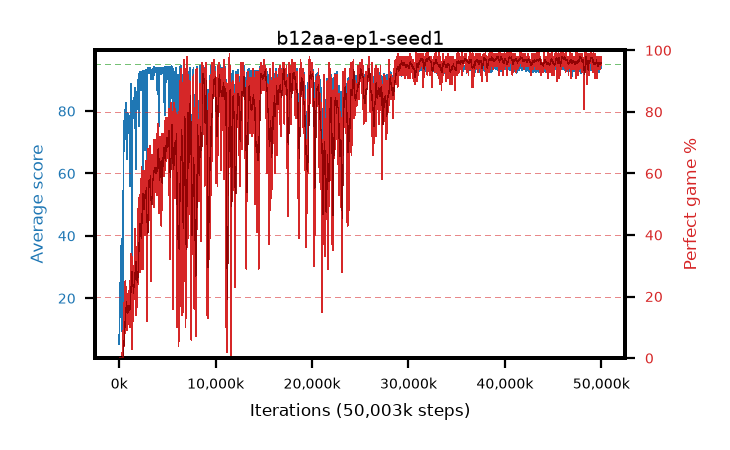

# b12aa-ep1-seed1

step **50,003,968** · 3052 evals · trailing **93.83** · peak **94.35** @45,776,896 · sef **71.8** · best30 **97.5** @46,252,032

## Config

| | |
|---|---|
| algo | ppo |
| collect_envs | 128 |
| discount | 0.99 |
| eval_interval | 16384 |
| eval_queue | True |
| eval_queue_depth | 16 |
| eval_workers | 8 |
| fc_layers | (320,) |
| graph_eval_episodes | 100 |
| max_steps | 50003968 |
| min_checkpoint_score | 40.0 |
| ppo_adam_epsilon | 1e-07 |
| ppo_anneal_fraction | 1.0 |
| ppo_clip | 0.2 |
| ppo_clip_final | None |
| ppo_entropy_coef | 0.01 |
| ppo_entropy_coef_final | None |
| ppo_epochs | 1 |
| ppo_gae_lambda | 0.99 |
| ppo_gradient_clipping | 0.5 |
| ppo_horizon | 50.3 |
| ppo_learning_rate | 0.0003 |
| ppo_learning_rate_final | None |
| ppo_minibatch | 256 |
| ppo_normalize_adv | True |
| ppo_rollout | 128 |
| ppo_target_kl | 0.0 |
| ppo_transitions_per_rollout | 16384 |
| ppo_value_loss | huber |
| ppo_vf_coef | 0.5 |
| seed | 1 |
| torch_threads | 1 |

## Evals

| step | avg score | trailing avg | min score | max score | avg reward | perfect % | epsilon |
|---|---|---|---|---|---|---|---|
| 16384 | 5.29 | 8.09 | 1.0 | 15.0 | 2.765 | 0.0 |  |
| 32768 | 10.89 | 10.89 | 2.0 | 29.0 | 5.89 | 0.0 |  |
| 49152 | 15.36 | 10.51 | 1.0 | 38.0 | 10.54 | 0.0 |  |
| ... | ... | ... | ... | ... | ... | ... | ... |
| 49823744 | 94.12 | 93.84 | 55.0 | 95.0 | 190.135 | 97.0 |  |
| 49840128 | 93.61 | 93.79 | 52.0 | 95.0 | 188.63 | 96.0 |  |
| 49856512 | 93.84 | 93.8 | 52.0 | 95.0 | 188.86 | 96.0 |  |
| 49872896 | 93.41 | 93.83 | 46.0 | 95.0 | 188.43 | 96.0 |  |
| 49889280 | 94.13 | 93.84 | 66.0 | 95.0 | 187.16 | 94.0 |  |
| 49905664 | 93.8 | 93.81 | 40.0 | 95.0 | 187.78 | 95.0 |  |
| 49922048 | 94.62 | 93.83 | 67.0 | 95.0 | 191.63 | 98.0 |  |
| 49938432 | 94.26 | 93.82 | 63.0 | 95.0 | 188.285 | 95.0 |  |
| 49954816 | 93.86 | 93.81 | 8.0 | 95.0 | 188.88 | 96.0 |  |
| 49971200 | 94.17 | 93.84 | 65.0 | 95.0 | 189.19 | 96.0 |  |
| 49987584 | 93.89 | 93.79 | 53.0 | 95.0 | 188.91 | 96.0 |  |
| 50003968 | 94.94 | 93.83 | 92.0 | 95.0 | 191.95 | 98.0 |  |
