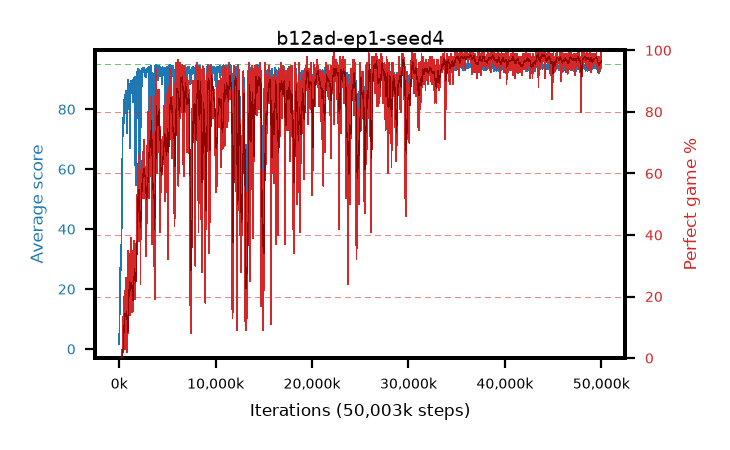

# b12ad-ep1-seed4

step **50,003,968** · 3052 evals · trailing **93.7** · peak **94.54** @43,941,888 · sef **75.5** · best30 **98.3** @44,171,264

## Config

| | |
|---|---|
| algo | ppo |
| collect_envs | 128 |
| discount | 0.99 |
| eval_interval | 16384 |
| eval_queue | True |
| eval_queue_depth | 16 |
| eval_workers | 8 |
| fc_layers | (320,) |
| graph_eval_episodes | 100 |
| max_steps | 50003968 |
| min_checkpoint_score | 40.0 |
| ppo_adam_epsilon | 1e-07 |
| ppo_anneal_fraction | 1.0 |
| ppo_clip | 0.2 |
| ppo_clip_final | None |
| ppo_entropy_coef | 0.01 |
| ppo_entropy_coef_final | None |
| ppo_epochs | 1 |
| ppo_gae_lambda | 0.99 |
| ppo_gradient_clipping | 0.5 |
| ppo_horizon | 50.3 |
| ppo_learning_rate | 0.0003 |
| ppo_learning_rate_final | None |
| ppo_minibatch | 256 |
| ppo_normalize_adv | True |
| ppo_rollout | 128 |
| ppo_target_kl | 0.0 |
| ppo_transitions_per_rollout | 16384 |
| ppo_value_loss | huber |
| ppo_vf_coef | 0.5 |
| seed | 4 |
| torch_threads | 1 |

## Evals

| step | avg score | trailing avg | min score | max score | avg reward | perfect % | epsilon |
|---|---|---|---|---|---|---|---|
| 16384 | 1.63 | 1.63 | 0.0 | 9.0 | 0.905 | 0.0 |  |
| 32768 | 9.56 | 8.21 | 1.0 | 27.0 | 5.91 | 0.0 |  |
| 49152 | 13.45 | 7.54 | 2.0 | 28.0 | 8.45 | 0.0 |  |
| ... | ... | ... | ... | ... | ... | ... | ... |
| 49823744 | 93.81 | 93.78 | 57.0 | 95.0 | 188.83 | 96.0 |  |
| 49840128 | 93.44 | 93.78 | 52.0 | 95.0 | 187.465 | 95.0 |  |
| 49856512 | 93.69 | 93.79 | 53.0 | 95.0 | 188.71 | 96.0 |  |
| 49872896 | 93.57 | 93.74 | 51.0 | 95.0 | 187.595 | 95.0 |  |
| 49889280 | 92.65 | 93.68 | 30.0 | 95.0 | 185.68 | 94.0 |  |
| 49905664 | 94.45 | 93.7 | 67.0 | 95.0 | 191.46 | 98.0 |  |
| 49922048 | 93.86 | 93.7 | 61.0 | 95.0 | 188.88 | 96.0 |  |
| 49938432 | 93.84 | 93.67 | 48.0 | 95.0 | 188.86 | 96.0 |  |
| 49954816 | 94.74 | 93.68 | 69.0 | 95.0 | 192.745 | 99.0 |  |
| 49971200 | 94.71 | 93.68 | 66.0 | 95.0 | 192.715 | 99.0 |  |
| 49987584 | 94.17 | 93.72 | 57.0 | 95.0 | 190.185 | 97.0 |  |
| 50003968 | 93.76 | 93.7 | 54.0 | 95.0 | 188.78 | 96.0 |  |
