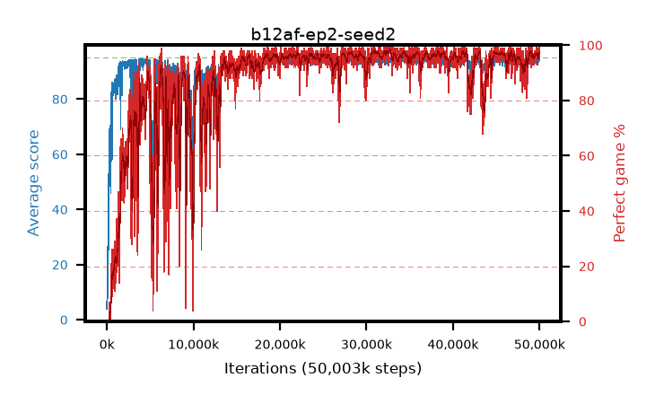

# b12af-ep2-seed2

step **50,003,968** · 3052 evals · trailing **94.07** · peak **94.29** @36,831,232 · sef **83.1** · best30 **98.0** @32,686,080

## Config

| | |
|---|---|
| algo | ppo |
| collect_envs | 128 |
| discount | 0.99 |
| eval_interval | 16384 |
| eval_queue | True |
| eval_queue_depth | 16 |
| eval_workers | 8 |
| fc_layers | (320,) |
| graph_eval_episodes | 100 |
| max_steps | 50003968 |
| min_checkpoint_score | 40.0 |
| ppo_adam_epsilon | 1e-07 |
| ppo_anneal_fraction | 1.0 |
| ppo_clip | 0.2 |
| ppo_clip_final | None |
| ppo_entropy_coef | 0.01 |
| ppo_entropy_coef_final | None |
| ppo_epochs | 2 |
| ppo_gae_lambda | 0.99 |
| ppo_gradient_clipping | 0.5 |
| ppo_horizon | 50.3 |
| ppo_learning_rate | 0.0003 |
| ppo_learning_rate_final | None |
| ppo_minibatch | 256 |
| ppo_normalize_adv | True |
| ppo_rollout | 128 |
| ppo_target_kl | 0.0 |
| ppo_transitions_per_rollout | 16384 |
| ppo_value_loss | huber |
| ppo_vf_coef | 0.5 |
| seed | 2 |
| torch_threads | 1 |

## Evals

| step | avg score | trailing avg | min score | max score | avg reward | perfect % | epsilon |
|---|---|---|---|---|---|---|---|
| 16384 | 3.93 | 3.93 | 0.0 | 16.0 | 1.36 | 0.0 |  |
| 32768 | 8.41 | 6.17 | 1.0 | 19.0 | 3.5 | 0.0 |  |
| 49152 | 7.64 | 6.66 | 0.0 | 22.0 | 3.99 | 0.0 |  |
| ... | ... | ... | ... | ... | ... | ... | ... |
| 49823744 | 93.73 | 93.91 | 24.0 | 95.0 | 188.75 | 96.0 |  |
| 49840128 | 93.39 | 93.93 | 10.0 | 95.0 | 188.41 | 96.0 |  |
| 49856512 | 94.14 | 94.08 | 12.0 | 95.0 | 191.15 | 98.0 |  |
| 49872896 | 94.53 | 94.1 | 71.0 | 95.0 | 191.54 | 98.0 |  |
| 49889280 | 94.11 | 94.08 | 6.0 | 95.0 | 192.115 | 99.0 |  |
| 49905664 | 93.64 | 94.05 | 55.0 | 95.0 | 188.66 | 96.0 |  |
| 49922048 | 95.0 | 94.07 | 95.0 | 95.0 | 194.0 | 100.0 |  |
| 49938432 | 94.6 | 94.02 | 58.0 | 95.0 | 191.61 | 98.0 |  |
| 49954816 | 94.46 | 93.98 | 58.0 | 95.0 | 190.475 | 97.0 |  |
| 49971200 | 94.38 | 94.1 | 61.0 | 95.0 | 189.4 | 96.0 |  |
| 49987584 | 94.19 | 93.97 | 58.0 | 95.0 | 189.21 | 96.0 |  |
| 50003968 | 94.95 | 94.07 | 90.0 | 95.0 | 192.955 | 99.0 |  |
