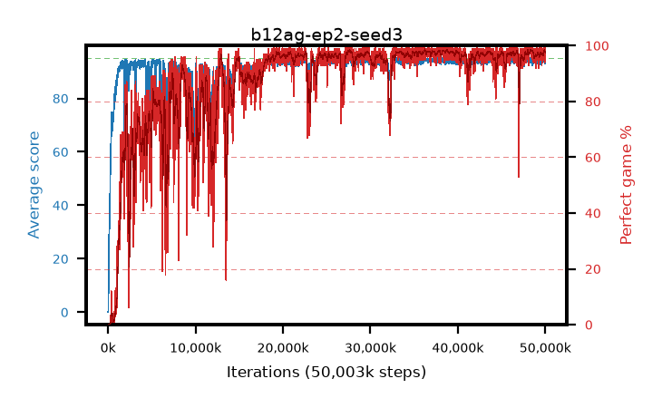

# b12ag-ep2-seed3

step **50,003,968** · 3052 evals · trailing **94.37** · peak **94.52** @48,250,880 · sef **80.4** · best30 **98.1** @48,611,328

## Config

| | |
|---|---|
| algo | ppo |
| collect_envs | 128 |
| discount | 0.99 |
| eval_interval | 16384 |
| eval_queue | True |
| eval_queue_depth | 16 |
| eval_workers | 8 |
| fc_layers | (320,) |
| graph_eval_episodes | 100 |
| max_steps | 50003968 |
| min_checkpoint_score | 40.0 |
| ppo_adam_epsilon | 1e-07 |
| ppo_anneal_fraction | 1.0 |
| ppo_clip | 0.2 |
| ppo_clip_final | None |
| ppo_entropy_coef | 0.01 |
| ppo_entropy_coef_final | None |
| ppo_epochs | 2 |
| ppo_gae_lambda | 0.99 |
| ppo_gradient_clipping | 0.5 |
| ppo_horizon | 50.3 |
| ppo_learning_rate | 0.0003 |
| ppo_learning_rate_final | None |
| ppo_minibatch | 256 |
| ppo_normalize_adv | True |
| ppo_rollout | 128 |
| ppo_target_kl | 0.0 |
| ppo_transitions_per_rollout | 16384 |
| ppo_value_loss | huber |
| ppo_vf_coef | 0.5 |
| seed | 3 |
| torch_threads | 1 |

## Evals

| step | avg score | trailing avg | min score | max score | avg reward | perfect % | epsilon |
|---|---|---|---|---|---|---|---|
| 16384 | 0.09 | 0.09 | 0.0 | 1.0 | -0.455 | 0.0 |  |
| 32768 | 0.27 | 0.18 | 0.0 | 3.0 | -0.23 | 0.0 |  |
| 49152 | 14.31 | 4.89 | 0.0 | 32.0 | 9.625 | 0.0 |  |
| ... | ... | ... | ... | ... | ... | ... | ... |
| 49823744 | 94.83 | 94.31 | 78.0 | 95.0 | 192.835 | 99.0 |  |
| 49840128 | 95.0 | 94.34 | 95.0 | 95.0 | 194.0 | 100.0 |  |
| 49856512 | 94.74 | 94.31 | 69.0 | 95.0 | 192.745 | 99.0 |  |
| 49872896 | 94.11 | 94.32 | 6.0 | 95.0 | 192.115 | 99.0 |  |
| 49889280 | 95.0 | 94.35 | 95.0 | 95.0 | 194.0 | 100.0 |  |
| 49905664 | 94.22 | 94.39 | 22.0 | 95.0 | 190.235 | 97.0 |  |
| 49922048 | 93.16 | 94.34 | 36.0 | 95.0 | 186.145 | 94.0 |  |
| 49938432 | 93.75 | 94.36 | 30.0 | 95.0 | 187.775 | 95.0 |  |
| 49954816 | 94.15 | 94.35 | 60.0 | 95.0 | 190.12 | 97.0 |  |
| 49971200 | 95.0 | 94.39 | 95.0 | 95.0 | 194.0 | 100.0 |  |
| 49987584 | 92.91 | 94.34 | 14.0 | 95.0 | 186.935 | 95.0 |  |
| 50003968 | 94.96 | 94.37 | 91.0 | 95.0 | 192.965 | 99.0 |  |
