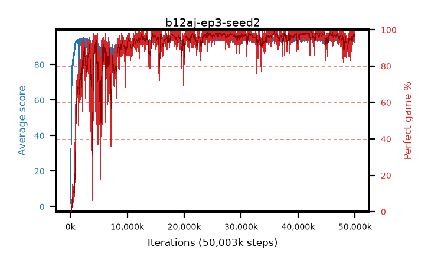

# b12aj-ep3-seed2

step **50,003,968** · 3052 evals · trailing **94.02** · peak **94.52** @36,339,712 · sef **90.7** · best30 **97.9** @41,664,512

## Config

| | |
|---|---|
| algo | ppo |
| collect_envs | 128 |
| discount | 0.99 |
| eval_interval | 16384 |
| eval_queue | True |
| eval_queue_depth | 16 |
| eval_workers | 8 |
| fc_layers | (320,) |
| graph_eval_episodes | 100 |
| max_steps | 50003968 |
| min_checkpoint_score | 40.0 |
| ppo_adam_epsilon | 1e-07 |
| ppo_anneal_fraction | 1.0 |
| ppo_clip | 0.2 |
| ppo_clip_final | None |
| ppo_entropy_coef | 0.01 |
| ppo_entropy_coef_final | None |
| ppo_epochs | 3 |
| ppo_gae_lambda | 0.99 |
| ppo_gradient_clipping | 0.5 |
| ppo_horizon | 50.3 |
| ppo_learning_rate | 0.0003 |
| ppo_learning_rate_final | None |
| ppo_minibatch | 256 |
| ppo_normalize_adv | True |
| ppo_rollout | 128 |
| ppo_target_kl | 0.0 |
| ppo_transitions_per_rollout | 16384 |
| ppo_value_loss | huber |
| ppo_vf_coef | 0.5 |
| seed | 2 |
| torch_threads | 1 |

## Evals

| step | avg score | trailing avg | min score | max score | avg reward | perfect % | epsilon |
|---|---|---|---|---|---|---|---|
| 16384 | 1.78 | 1.78 | 0.0 | 5.0 | -1.105 | 0.0 |  |
| 32768 | 3.08 | 2.43 | 0.0 | 8.0 | -1.605 | 0.0 |  |
| 49152 | 11.65 | 5.5 | 2.0 | 33.0 | 6.65 | 0.0 |  |
| ... | ... | ... | ... | ... | ... | ... | ... |
| 49823744 | 92.66 | 93.9 | 12.0 | 95.0 | 188.585 | 97.0 |  |
| 49840128 | 94.75 | 93.92 | 76.0 | 95.0 | 191.76 | 98.0 |  |
| 49856512 | 94.1 | 93.93 | 60.0 | 95.0 | 187.13 | 94.0 |  |
| 49872896 | 94.66 | 93.87 | 61.0 | 95.0 | 192.665 | 99.0 |  |
| 49889280 | 93.68 | 93.98 | 29.0 | 95.0 | 187.615 | 95.0 |  |
| 49905664 | 94.7 | 94.06 | 68.0 | 95.0 | 191.71 | 98.0 |  |
| 49922048 | 93.78 | 93.87 | 14.0 | 95.0 | 188.755 | 96.0 |  |
| 49938432 | 94.58 | 93.93 | 62.0 | 95.0 | 191.59 | 98.0 |  |
| 49954816 | 93.61 | 93.98 | 11.0 | 95.0 | 188.585 | 96.0 |  |
| 49971200 | 95.0 | 94.11 | 95.0 | 95.0 | 194.0 | 100.0 |  |
| 49987584 | 95.0 | 94.14 | 95.0 | 95.0 | 194.0 | 100.0 |  |
| 50003968 | 94.13 | 94.02 | 60.0 | 95.0 | 190.1 | 97.0 |  |
