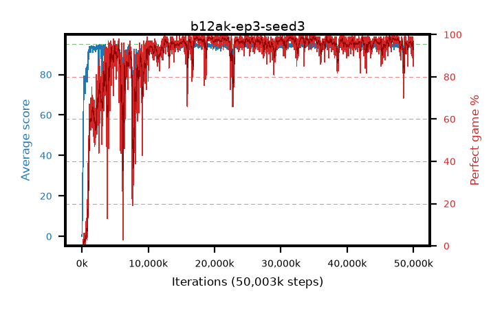

# b12ak-ep3-seed3

step **50,003,968** · 3052 evals · trailing **93.86** · peak **94.63** @33,341,440 · sef **89.3** · best30 **98.6** @33,357,824

## Config

| | |
|---|---|
| algo | ppo |
| collect_envs | 128 |
| discount | 0.99 |
| eval_interval | 16384 |
| eval_queue | True |
| eval_queue_depth | 16 |
| eval_workers | 8 |
| fc_layers | (320,) |
| graph_eval_episodes | 100 |
| max_steps | 50003968 |
| min_checkpoint_score | 40.0 |
| ppo_adam_epsilon | 1e-07 |
| ppo_anneal_fraction | 1.0 |
| ppo_clip | 0.2 |
| ppo_clip_final | None |
| ppo_entropy_coef | 0.01 |
| ppo_entropy_coef_final | None |
| ppo_epochs | 3 |
| ppo_gae_lambda | 0.99 |
| ppo_gradient_clipping | 0.5 |
| ppo_horizon | 50.3 |
| ppo_learning_rate | 0.0003 |
| ppo_learning_rate_final | None |
| ppo_minibatch | 256 |
| ppo_normalize_adv | True |
| ppo_rollout | 128 |
| ppo_target_kl | 0.0 |
| ppo_transitions_per_rollout | 16384 |
| ppo_value_loss | huber |
| ppo_vf_coef | 0.5 |
| seed | 3 |
| torch_threads | 1 |

## Evals

| step | avg score | trailing avg | min score | max score | avg reward | perfect % | epsilon |
|---|---|---|---|---|---|---|---|
| 16384 | 0.05 | 0.05 | 0.0 | 1.0 | -0.45 | 0.0 |  |
| 32768 | 1.45 | 0.75 | 0.0 | 5.0 | 0.95 | 0.0 |  |
| 49152 | 13.99 | 5.16 | 0.0 | 32.0 | 9.71 | 0.0 |  |
| ... | ... | ... | ... | ... | ... | ... | ... |
| 49823744 | 94.82 | 94.05 | 86.0 | 95.0 | 191.785 | 98.0 |  |
| 49840128 | 94.4 | 94.06 | 65.0 | 95.0 | 190.415 | 97.0 |  |
| 49856512 | 93.94 | 94.04 | 60.0 | 95.0 | 188.96 | 96.0 |  |
| 49872896 | 94.72 | 94.01 | 67.0 | 95.0 | 192.725 | 99.0 |  |
| 49889280 | 94.21 | 93.99 | 66.0 | 95.0 | 188.235 | 95.0 |  |
| 49905664 | 93.12 | 93.96 | 30.0 | 95.0 | 181.175 | 89.0 |  |
| 49922048 | 94.43 | 93.94 | 65.0 | 95.0 | 189.45 | 96.0 |  |
| 49938432 | 92.2 | 93.87 | 12.0 | 95.0 | 176.275 | 85.0 |  |
| 49954816 | 93.75 | 93.98 | 53.0 | 95.0 | 184.79 | 92.0 |  |
| 49971200 | 93.27 | 93.93 | 53.0 | 95.0 | 181.325 | 89.0 |  |
| 49987584 | 93.62 | 93.83 | 61.0 | 95.0 | 181.675 | 89.0 |  |
| 50003968 | 94.41 | 93.86 | 59.0 | 95.0 | 190.425 | 97.0 |  |
