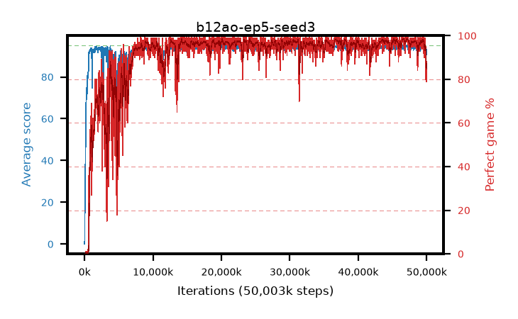

# b12ao-ep5-seed3

step **50,003,968** · 3052 evals · trailing **93.66** · peak **94.67** @47,316,992 · sef **89.6** · best30 **98.3** @47,333,376

## Config

| | |
|---|---|
| algo | ppo |
| collect_envs | 128 |
| discount | 0.99 |
| eval_interval | 16384 |
| eval_queue | True |
| eval_queue_depth | 16 |
| eval_workers | 8 |
| fc_layers | (320,) |
| graph_eval_episodes | 100 |
| max_steps | 50003968 |
| min_checkpoint_score | 40.0 |
| ppo_adam_epsilon | 1e-07 |
| ppo_anneal_fraction | 1.0 |
| ppo_clip | 0.2 |
| ppo_clip_final | None |
| ppo_entropy_coef | 0.01 |
| ppo_entropy_coef_final | None |
| ppo_epochs | 5 |
| ppo_gae_lambda | 0.99 |
| ppo_gradient_clipping | 0.5 |
| ppo_horizon | 50.3 |
| ppo_learning_rate | 0.0003 |
| ppo_learning_rate_final | None |
| ppo_minibatch | 256 |
| ppo_normalize_adv | True |
| ppo_rollout | 128 |
| ppo_target_kl | 0.0 |
| ppo_transitions_per_rollout | 16384 |
| ppo_value_loss | huber |
| ppo_vf_coef | 0.5 |
| seed | 3 |
| torch_threads | 1 |

## Evals

| step | avg score | trailing avg | min score | max score | avg reward | perfect % | epsilon |
|---|---|---|---|---|---|---|---|
| 16384 | 0.07 | 0.07 | 0.0 | 1.0 | -4.255 | 0.0 |  |
| 32768 | 2.38 | 1.22 | 0.0 | 10.0 | 1.565 | 0.0 |  |
| 49152 | 20.97 | 15.71 | 2.0 | 58.0 | 16.375 | 0.0 |  |
| ... | ... | ... | ... | ... | ... | ... | ... |
| 49823744 | 94.43 | 94.34 | 68.0 | 95.0 | 188.455 | 95.0 |  |
| 49840128 | 93.07 | 94.35 | 72.0 | 95.0 | 179.135 | 87.0 |  |
| 49856512 | 93.19 | 94.2 | 75.0 | 95.0 | 177.265 | 85.0 |  |
| 49872896 | 92.45 | 94.14 | 67.0 | 95.0 | 171.415 | 80.0 |  |
| 49889280 | 93.24 | 93.98 | 59.0 | 95.0 | 177.27 | 85.0 |  |
| 49905664 | 94.4 | 94.13 | 78.0 | 95.0 | 186.345 | 93.0 |  |
| 49922048 | 92.34 | 94.07 | 70.0 | 95.0 | 172.39 | 81.0 |  |
| 49938432 | 93.06 | 94.02 | 66.0 | 95.0 | 178.085 | 86.0 |  |
| 49954816 | 93.02 | 93.8 | 71.0 | 95.0 | 176.1 | 84.0 |  |
| 49971200 | 93.22 | 93.75 | 54.0 | 95.0 | 180.19 | 88.0 |  |
| 49987584 | 90.69 | 93.86 | 6.0 | 95.0 | 168.795 | 79.0 |  |
| 50003968 | 92.34 | 93.66 | 12.0 | 95.0 | 178.36 | 87.0 |  |
