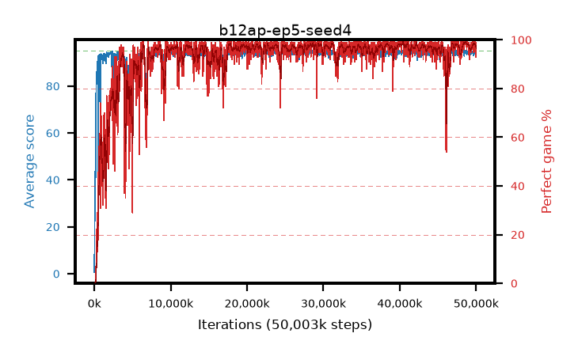

# b12ap-ep5-seed4

step **50,003,968** · 3052 evals · trailing **94.45** · peak **94.69** @48,611,328 · sef **91.8** · best30 **98.8** @48,676,864

## Config

| | |
|---|---|
| algo | ppo |
| collect_envs | 128 |
| discount | 0.99 |
| eval_interval | 16384 |
| eval_queue | True |
| eval_queue_depth | 16 |
| eval_workers | 8 |
| fc_layers | (320,) |
| graph_eval_episodes | 100 |
| max_steps | 50003968 |
| min_checkpoint_score | 40.0 |
| ppo_adam_epsilon | 1e-07 |
| ppo_anneal_fraction | 1.0 |
| ppo_clip | 0.2 |
| ppo_clip_final | None |
| ppo_entropy_coef | 0.01 |
| ppo_entropy_coef_final | None |
| ppo_epochs | 5 |
| ppo_gae_lambda | 0.99 |
| ppo_gradient_clipping | 0.5 |
| ppo_horizon | 50.3 |
| ppo_learning_rate | 0.0003 |
| ppo_learning_rate_final | None |
| ppo_minibatch | 256 |
| ppo_normalize_adv | True |
| ppo_rollout | 128 |
| ppo_target_kl | 0.0 |
| ppo_transitions_per_rollout | 16384 |
| ppo_value_loss | huber |
| ppo_vf_coef | 0.5 |
| seed | 4 |
| torch_threads | 1 |

## Evals

| step | avg score | trailing avg | min score | max score | avg reward | perfect % | epsilon |
|---|---|---|---|---|---|---|---|
| 16384 | 0.63 | 0.63 | 0.0 | 7.0 | -0.545 | 0.0 |  |
| 32768 | 19.46 | 10.04 | 1.0 | 39.0 | 14.82 | 0.0 |  |
| 49152 | 26.55 | 15.55 | 8.0 | 52.0 | 21.55 | 0.0 |  |
| ... | ... | ... | ... | ... | ... | ... | ... |
| 49823744 | 95.0 | 94.48 | 95.0 | 95.0 | 194.0 | 100.0 |  |
| 49840128 | 94.97 | 94.55 | 92.0 | 95.0 | 192.93 | 99.0 |  |
| 49856512 | 94.07 | 94.49 | 20.0 | 95.0 | 191.08 | 98.0 |  |
| 49872896 | 94.24 | 94.48 | 65.0 | 95.0 | 189.17 | 96.0 |  |
| 49889280 | 94.79 | 94.52 | 84.0 | 95.0 | 190.76 | 97.0 |  |
| 49905664 | 94.85 | 94.53 | 80.0 | 95.0 | 192.855 | 99.0 |  |
| 49922048 | 93.7 | 94.51 | 28.0 | 95.0 | 188.63 | 96.0 |  |
| 49938432 | 94.33 | 94.51 | 38.0 | 95.0 | 190.3 | 97.0 |  |
| 49954816 | 94.78 | 94.5 | 88.0 | 95.0 | 188.805 | 95.0 |  |
| 49971200 | 93.91 | 94.47 | 45.0 | 95.0 | 185.9 | 93.0 |  |
| 49987584 | 94.23 | 94.49 | 18.0 | 95.0 | 192.19 | 99.0 |  |
| 50003968 | 94.04 | 94.45 | 60.0 | 95.0 | 188.065 | 95.0 |  |
