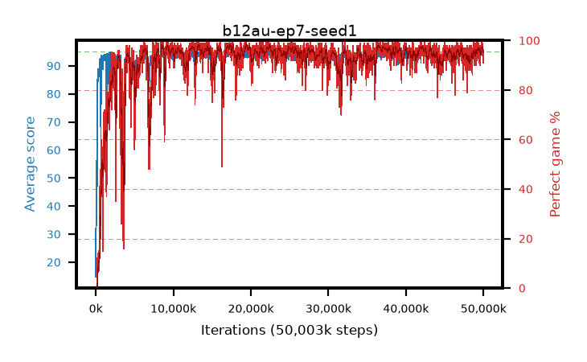

# b12au-ep7-seed1

step **50,003,968** · 3052 evals · trailing **94.34** · peak **94.44** @49,741,824 · sef **92.4** · best30 **97.6** @36,683,776

## Config

| | |
|---|---|
| algo | ppo |
| collect_envs | 128 |
| discount | 0.99 |
| eval_interval | 16384 |
| eval_queue | True |
| eval_queue_depth | 16 |
| eval_workers | 8 |
| fc_layers | (320,) |
| graph_eval_episodes | 100 |
| max_steps | 50003968 |
| min_checkpoint_score | 40.0 |
| ppo_adam_epsilon | 1e-07 |
| ppo_anneal_fraction | 1.0 |
| ppo_clip | 0.2 |
| ppo_clip_final | None |
| ppo_entropy_coef | 0.01 |
| ppo_entropy_coef_final | None |
| ppo_epochs | 7 |
| ppo_gae_lambda | 0.99 |
| ppo_gradient_clipping | 0.5 |
| ppo_horizon | 50.3 |
| ppo_learning_rate | 0.0003 |
| ppo_learning_rate_final | None |
| ppo_minibatch | 256 |
| ppo_normalize_adv | True |
| ppo_rollout | 128 |
| ppo_target_kl | 0.0 |
| ppo_transitions_per_rollout | 16384 |
| ppo_value_loss | huber |
| ppo_vf_coef | 0.5 |
| seed | 1 |
| torch_threads | 1 |

## Evals

| step | avg score | trailing avg | min score | max score | avg reward | perfect % | epsilon |
|---|---|---|---|---|---|---|---|
| 16384 | 14.79 | 14.79 | 1.0 | 42.0 | 10.51 | 0.0 |  |
| 32768 | 43.71 | 35.23 | 11.0 | 82.0 | 38.935 | 0.0 |  |
| 49152 | 34.68 | 27.56 | 8.0 | 78.0 | 29.68 | 0.0 |  |
| ... | ... | ... | ... | ... | ... | ... | ... |
| 49823744 | 94.35 | 94.41 | 34.0 | 95.0 | 191.36 | 98.0 |  |
| 49840128 | 94.22 | 94.4 | 64.0 | 95.0 | 188.11 | 95.0 |  |
| 49856512 | 94.9 | 94.37 | 85.0 | 95.0 | 192.905 | 99.0 |  |
| 49872896 | 94.46 | 94.37 | 60.0 | 95.0 | 189.435 | 96.0 |  |
| 49889280 | 93.77 | 94.31 | 52.0 | 95.0 | 186.665 | 94.0 |  |
| 49905664 | 93.97 | 94.37 | 40.0 | 95.0 | 189.895 | 97.0 |  |
| 49922048 | 94.51 | 94.39 | 74.0 | 95.0 | 190.48 | 97.0 |  |
| 49938432 | 94.15 | 94.34 | 70.0 | 95.0 | 187.045 | 94.0 |  |
| 49954816 | 93.48 | 94.28 | 49.0 | 95.0 | 183.48 | 91.0 |  |
| 49971200 | 93.38 | 94.35 | 18.0 | 95.0 | 186.32 | 94.0 |  |
| 49987584 | 93.48 | 94.29 | 35.0 | 95.0 | 187.325 | 95.0 |  |
| 50003968 | 93.92 | 94.34 | 44.0 | 95.0 | 185.82 | 93.0 |  |
