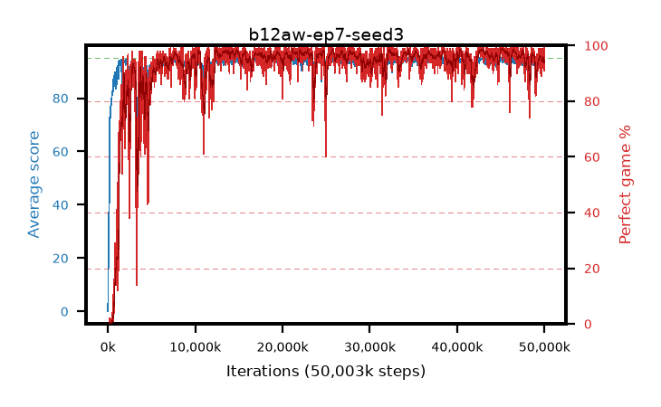

# b12aw-ep7-seed3

step **50,003,968** · 3052 evals · trailing **93.7** · peak **94.7** @45,580,288 · sef **93.7** · best30 **98.5** @45,350,912

## Config

| | |
|---|---|
| algo | ppo |
| collect_envs | 128 |
| discount | 0.99 |
| eval_interval | 16384 |
| eval_queue | True |
| eval_queue_depth | 16 |
| eval_workers | 8 |
| fc_layers | (320,) |
| graph_eval_episodes | 100 |
| max_steps | 50003968 |
| min_checkpoint_score | 40.0 |
| ppo_adam_epsilon | 1e-07 |
| ppo_anneal_fraction | 1.0 |
| ppo_clip | 0.2 |
| ppo_clip_final | None |
| ppo_entropy_coef | 0.01 |
| ppo_entropy_coef_final | None |
| ppo_epochs | 7 |
| ppo_gae_lambda | 0.99 |
| ppo_gradient_clipping | 0.5 |
| ppo_horizon | 50.3 |
| ppo_learning_rate | 0.0003 |
| ppo_learning_rate_final | None |
| ppo_minibatch | 256 |
| ppo_normalize_adv | True |
| ppo_rollout | 128 |
| ppo_target_kl | 0.0 |
| ppo_transitions_per_rollout | 16384 |
| ppo_value_loss | huber |
| ppo_vf_coef | 0.5 |
| seed | 3 |
| torch_threads | 1 |

## Evals

| step | avg score | trailing avg | min score | max score | avg reward | perfect % | epsilon |
|---|---|---|---|---|---|---|---|
| 16384 | 0.07 | 0.07 | 0.0 | 2.0 | -2.365 | 0.0 |  |
| 32768 | 5.1 | 13.24 | 0.0 | 22.0 | 2.935 | 0.0 |  |
| 49152 | 21.69 | 10.88 | 0.0 | 41.0 | 16.915 | 0.0 |  |
| ... | ... | ... | ... | ... | ... | ... | ... |
| 49823744 | 94.78 | 93.79 | 73.0 | 95.0 | 192.74 | 99.0 |  |
| 49840128 | 93.24 | 93.73 | 15.0 | 95.0 | 185.185 | 93.0 |  |
| 49856512 | 94.67 | 93.79 | 74.0 | 95.0 | 190.64 | 97.0 |  |
| 49872896 | 93.72 | 93.67 | 73.0 | 95.0 | 184.67 | 92.0 |  |
| 49889280 | 93.46 | 93.65 | 2.0 | 95.0 | 185.495 | 93.0 |  |
| 49905664 | 94.22 | 93.79 | 59.0 | 95.0 | 189.105 | 96.0 |  |
| 49922048 | 94.68 | 93.8 | 80.0 | 95.0 | 190.695 | 97.0 |  |
| 49938432 | 92.44 | 93.75 | 8.0 | 95.0 | 182.26 | 91.0 |  |
| 49954816 | 91.3 | 93.68 | 10.0 | 95.0 | 181.255 | 91.0 |  |
| 49971200 | 93.92 | 93.67 | 65.0 | 95.0 | 185.82 | 93.0 |  |
| 49987584 | 93.82 | 93.67 | 53.0 | 95.0 | 187.755 | 95.0 |  |
| 50003968 | 95.0 | 93.7 | 95.0 | 95.0 | 194.0 | 100.0 |  |
