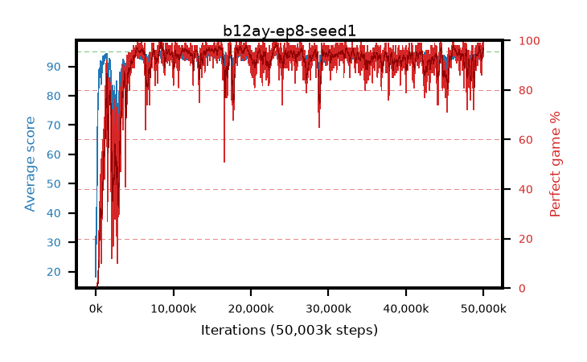

# b12ay-ep8-seed1

step **50,003,968** · 3052 evals · trailing **93.61** · peak **94.45** @8,732,672 · sef **91.5** · best30 **97.8** @23,412,736

## Config

| | |
|---|---|
| algo | ppo |
| collect_envs | 128 |
| discount | 0.99 |
| eval_interval | 16384 |
| eval_queue | True |
| eval_queue_depth | 16 |
| eval_workers | 8 |
| fc_layers | (320,) |
| graph_eval_episodes | 100 |
| max_steps | 50003968 |
| min_checkpoint_score | 40.0 |
| ppo_adam_epsilon | 1e-07 |
| ppo_anneal_fraction | 1.0 |
| ppo_clip | 0.2 |
| ppo_clip_final | None |
| ppo_entropy_coef | 0.01 |
| ppo_entropy_coef_final | None |
| ppo_epochs | 8 |
| ppo_gae_lambda | 0.99 |
| ppo_gradient_clipping | 0.5 |
| ppo_horizon | 50.3 |
| ppo_learning_rate | 0.0003 |
| ppo_learning_rate_final | None |
| ppo_minibatch | 256 |
| ppo_normalize_adv | True |
| ppo_rollout | 128 |
| ppo_target_kl | 0.0 |
| ppo_transitions_per_rollout | 16384 |
| ppo_value_loss | huber |
| ppo_vf_coef | 0.5 |
| seed | 1 |
| torch_threads | 1 |

## Evals

| step | avg score | trailing avg | min score | max score | avg reward | perfect % | epsilon |
|---|---|---|---|---|---|---|---|
| 16384 | 18.2 | 18.2 | 5.0 | 32.0 | 13.92 | 0.0 |  |
| 32768 | 41.46 | 32.56 | 20.0 | 81.0 | 36.46 | 0.0 |  |
| 49152 | 36.96 | 27.58 | 5.0 | 68.0 | 32.05 | 0.0 |  |
| ... | ... | ... | ... | ... | ... | ... | ... |
| 49823744 | 94.5 | 93.6 | 62.0 | 95.0 | 190.425 | 97.0 |  |
| 49840128 | 94.96 | 93.63 | 91.0 | 95.0 | 192.92 | 99.0 |  |
| 49856512 | 93.14 | 93.55 | 10.0 | 95.0 | 187.075 | 95.0 |  |
| 49872896 | 94.44 | 93.62 | 57.0 | 95.0 | 190.365 | 97.0 |  |
| 49889280 | 92.82 | 93.57 | 27.0 | 95.0 | 184.765 | 93.0 |  |
| 49905664 | 93.43 | 93.52 | 32.0 | 95.0 | 186.28 | 94.0 |  |
| 49922048 | 93.01 | 93.5 | 11.0 | 95.0 | 187.94 | 96.0 |  |
| 49938432 | 94.75 | 93.54 | 70.0 | 95.0 | 192.755 | 99.0 |  |
| 49954816 | 95.0 | 93.53 | 95.0 | 95.0 | 194.0 | 100.0 |  |
| 49971200 | 93.35 | 93.6 | 17.0 | 95.0 | 186.2 | 94.0 |  |
| 49987584 | 94.04 | 93.64 | 46.0 | 95.0 | 189.965 | 97.0 |  |
| 50003968 | 93.57 | 93.61 | 24.0 | 95.0 | 188.455 | 96.0 |  |
