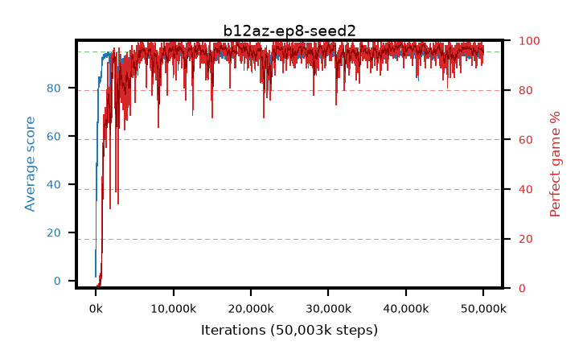

# b12az-ep8-seed2

step **50,003,968** · 3052 evals · trailing **94.3** · peak **94.54** @42,401,792 · sef **94.0** · best30 **98.2** @39,485,440

## Config

| | |
|---|---|
| algo | ppo |
| collect_envs | 128 |
| discount | 0.99 |
| eval_interval | 16384 |
| eval_queue | True |
| eval_queue_depth | 16 |
| eval_workers | 8 |
| fc_layers | (320,) |
| graph_eval_episodes | 100 |
| max_steps | 50003968 |
| min_checkpoint_score | 40.0 |
| ppo_adam_epsilon | 1e-07 |
| ppo_anneal_fraction | 1.0 |
| ppo_clip | 0.2 |
| ppo_clip_final | None |
| ppo_entropy_coef | 0.01 |
| ppo_entropy_coef_final | None |
| ppo_epochs | 8 |
| ppo_gae_lambda | 0.99 |
| ppo_gradient_clipping | 0.5 |
| ppo_horizon | 50.3 |
| ppo_learning_rate | 0.0003 |
| ppo_learning_rate_final | None |
| ppo_minibatch | 256 |
| ppo_normalize_adv | True |
| ppo_rollout | 128 |
| ppo_target_kl | 0.0 |
| ppo_transitions_per_rollout | 16384 |
| ppo_value_loss | huber |
| ppo_vf_coef | 0.5 |
| seed | 2 |
| torch_threads | 1 |

## Evals

| step | avg score | trailing avg | min score | max score | avg reward | perfect % | epsilon |
|---|---|---|---|---|---|---|---|
| 16384 | 1.58 | 1.58 | 0.0 | 5.0 | -1.755 | 0.0 |  |
| 32768 | 21.51 | 25.66 | 5.0 | 47.0 | 17.68 | 0.0 |  |
| 49152 | 39.29 | 20.43 | 13.0 | 69.0 | 34.65 | 0.0 |  |
| ... | ... | ... | ... | ... | ... | ... | ... |
| 49823744 | 94.42 | 94.23 | 55.0 | 95.0 | 191.43 | 98.0 |  |
| 49840128 | 94.61 | 94.23 | 60.0 | 95.0 | 191.62 | 98.0 |  |
| 49856512 | 94.27 | 94.27 | 60.0 | 95.0 | 189.29 | 96.0 |  |
| 49872896 | 94.33 | 94.28 | 67.0 | 95.0 | 188.31 | 95.0 |  |
| 49889280 | 94.46 | 94.28 | 81.0 | 95.0 | 184.505 | 91.0 |  |
| 49905664 | 94.73 | 94.24 | 84.0 | 95.0 | 189.75 | 96.0 |  |
| 49922048 | 94.59 | 94.27 | 83.0 | 95.0 | 188.615 | 95.0 |  |
| 49938432 | 93.67 | 94.25 | 30.0 | 95.0 | 187.695 | 95.0 |  |
| 49954816 | 94.02 | 94.29 | 35.0 | 95.0 | 188.95 | 96.0 |  |
| 49971200 | 94.0 | 94.28 | 64.0 | 95.0 | 188.025 | 95.0 |  |
| 49987584 | 93.96 | 94.29 | 43.0 | 95.0 | 187.94 | 95.0 |  |
| 50003968 | 94.82 | 94.3 | 84.0 | 95.0 | 191.83 | 98.0 |  |
