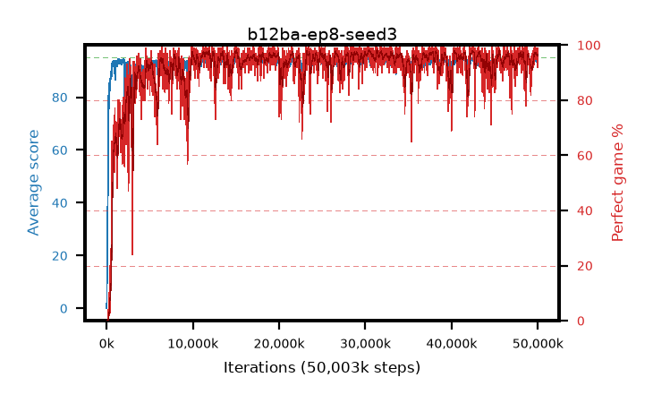

# b12ba-ep8-seed3

step **50,003,968** · 3052 evals · trailing **94.24** · peak **94.48** @42,549,248 · sef **92.8** · best30 **97.6** @30,605,312

## Config

| | |
|---|---|
| algo | ppo |
| collect_envs | 128 |
| discount | 0.99 |
| eval_interval | 16384 |
| eval_queue | True |
| eval_queue_depth | 16 |
| eval_workers | 8 |
| fc_layers | (320,) |
| graph_eval_episodes | 100 |
| max_steps | 50003968 |
| min_checkpoint_score | 40.0 |
| ppo_adam_epsilon | 1e-07 |
| ppo_anneal_fraction | 1.0 |
| ppo_clip | 0.2 |
| ppo_clip_final | None |
| ppo_entropy_coef | 0.01 |
| ppo_entropy_coef_final | None |
| ppo_epochs | 8 |
| ppo_gae_lambda | 0.99 |
| ppo_gradient_clipping | 0.5 |
| ppo_horizon | 50.3 |
| ppo_learning_rate | 0.0003 |
| ppo_learning_rate_final | None |
| ppo_minibatch | 256 |
| ppo_normalize_adv | True |
| ppo_rollout | 128 |
| ppo_target_kl | 0.0 |
| ppo_transitions_per_rollout | 16384 |
| ppo_value_loss | huber |
| ppo_vf_coef | 0.5 |
| seed | 3 |
| torch_threads | 1 |

## Evals

| step | avg score | trailing avg | min score | max score | avg reward | perfect % | epsilon |
|---|---|---|---|---|---|---|---|
| 16384 | 0.07 | 0.07 | 0.0 | 2.0 | -4.48 | 0.0 |  |
| 32768 | 2.99 | 1.53 | 0.0 | 12.0 | 2.085 | 0.0 |  |
| 49152 | 17.4 | 6.82 | 0.0 | 33.0 | 12.715 | 0.0 |  |
| ... | ... | ... | ... | ... | ... | ... | ... |
| 49823744 | 94.81 | 94.2 | 76.0 | 95.0 | 192.815 | 99.0 |  |
| 49840128 | 93.68 | 94.2 | 34.0 | 95.0 | 187.48 | 95.0 |  |
| 49856512 | 94.27 | 94.22 | 69.0 | 95.0 | 189.2 | 96.0 |  |
| 49872896 | 94.3 | 94.23 | 38.0 | 95.0 | 190.27 | 97.0 |  |
| 49889280 | 93.37 | 94.19 | 12.0 | 95.0 | 187.35 | 95.0 |  |
| 49905664 | 94.95 | 94.2 | 90.0 | 95.0 | 192.955 | 99.0 |  |
| 49922048 | 94.37 | 94.24 | 58.0 | 95.0 | 189.345 | 96.0 |  |
| 49938432 | 93.92 | 94.26 | 34.0 | 95.0 | 189.8 | 97.0 |  |
| 49954816 | 93.49 | 94.24 | 62.0 | 95.0 | 184.53 | 92.0 |  |
| 49971200 | 94.25 | 94.25 | 20.0 | 95.0 | 192.21 | 99.0 |  |
| 49987584 | 94.01 | 94.23 | 10.0 | 95.0 | 189.98 | 97.0 |  |
| 50003968 | 94.79 | 94.24 | 81.0 | 95.0 | 191.8 | 98.0 |  |
