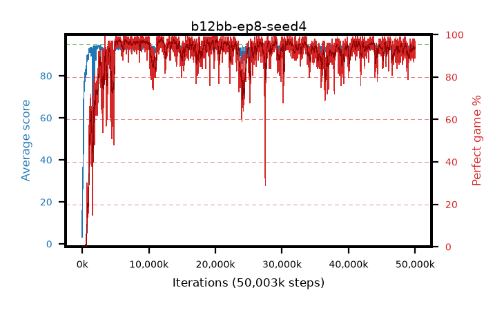

# b12bb-ep8-seed4

step **50,003,968** · 3052 evals · trailing **93.48** · peak **94.41** @11,763,712 · sef **91.3** · best30 **97.5** @11,993,088

## Config

| | |
|---|---|
| algo | ppo |
| collect_envs | 128 |
| discount | 0.99 |
| eval_interval | 16384 |
| eval_queue | True |
| eval_queue_depth | 16 |
| eval_workers | 8 |
| fc_layers | (320,) |
| graph_eval_episodes | 100 |
| max_steps | 50003968 |
| min_checkpoint_score | 40.0 |
| ppo_adam_epsilon | 1e-07 |
| ppo_anneal_fraction | 1.0 |
| ppo_clip | 0.2 |
| ppo_clip_final | None |
| ppo_entropy_coef | 0.01 |
| ppo_entropy_coef_final | None |
| ppo_epochs | 8 |
| ppo_gae_lambda | 0.99 |
| ppo_gradient_clipping | 0.5 |
| ppo_horizon | 50.3 |
| ppo_learning_rate | 0.0003 |
| ppo_learning_rate_final | None |
| ppo_minibatch | 256 |
| ppo_normalize_adv | True |
| ppo_rollout | 128 |
| ppo_target_kl | 0.0 |
| ppo_transitions_per_rollout | 16384 |
| ppo_value_loss | huber |
| ppo_vf_coef | 0.5 |
| seed | 4 |
| torch_threads | 1 |

## Evals

| step | avg score | trailing avg | min score | max score | avg reward | perfect % | epsilon |
|---|---|---|---|---|---|---|---|
| 16384 | 3.25 | 3.25 | 0.0 | 9.0 | -0.715 | 0.0 |  |
| 32768 | 24.51 | 21.15 | 6.0 | 45.0 | 19.825 | 0.0 |  |
| 49152 | 27.9 | 15.57 | 10.0 | 43.0 | 22.9 | 0.0 |  |
| ... | ... | ... | ... | ... | ... | ... | ... |
| 49823744 | 94.36 | 93.33 | 79.0 | 95.0 | 186.125 | 93.0 |  |
| 49840128 | 93.67 | 93.33 | 57.0 | 95.0 | 186.61 | 94.0 |  |
| 49856512 | 93.39 | 93.28 | 33.0 | 95.0 | 186.33 | 94.0 |  |
| 49872896 | 91.84 | 93.27 | 1.0 | 95.0 | 185.865 | 95.0 |  |
| 49889280 | 92.8 | 93.4 | 1.0 | 95.0 | 186.735 | 95.0 |  |
| 49905664 | 94.68 | 93.38 | 67.0 | 95.0 | 191.645 | 98.0 |  |
| 49922048 | 92.59 | 93.49 | 18.0 | 95.0 | 186.48 | 95.0 |  |
| 49938432 | 93.12 | 93.41 | 23.0 | 95.0 | 186.92 | 95.0 |  |
| 49954816 | 92.12 | 93.53 | 49.0 | 95.0 | 179.905 | 89.0 |  |
| 49971200 | 92.47 | 93.49 | 31.0 | 95.0 | 182.335 | 91.0 |  |
| 49987584 | 94.41 | 93.58 | 49.0 | 95.0 | 190.335 | 97.0 |  |
| 50003968 | 93.11 | 93.48 | 8.0 | 95.0 | 187.09 | 95.0 |  |
