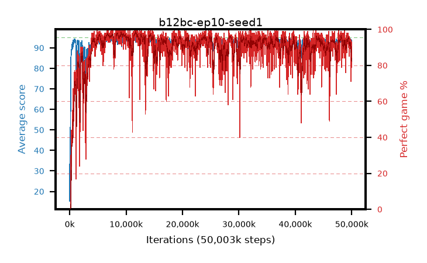

# b12bc-ep10-seed1

step **50,003,968** · 3052 evals · trailing **92.31** · peak **94.51** @11,714,560 · sef **88.8** · best30 **97.8** @11,763,712

## Config

| | |
|---|---|
| algo | ppo |
| collect_envs | 128 |
| discount | 0.99 |
| eval_interval | 16384 |
| eval_queue | True |
| eval_queue_depth | 16 |
| eval_workers | 8 |
| fc_layers | (320,) |
| graph_eval_episodes | 100 |
| max_steps | 50003968 |
| min_checkpoint_score | 40.0 |
| ppo_adam_epsilon | 1e-07 |
| ppo_anneal_fraction | 1.0 |
| ppo_clip | 0.2 |
| ppo_clip_final | None |
| ppo_entropy_coef | 0.01 |
| ppo_entropy_coef_final | None |
| ppo_epochs | 10 |
| ppo_gae_lambda | 0.99 |
| ppo_gradient_clipping | 0.5 |
| ppo_horizon | 50.3 |
| ppo_learning_rate | 0.0003 |
| ppo_learning_rate_final | None |
| ppo_minibatch | 256 |
| ppo_normalize_adv | True |
| ppo_rollout | 128 |
| ppo_target_kl | 0.0 |
| ppo_transitions_per_rollout | 16384 |
| ppo_value_loss | huber |
| ppo_vf_coef | 0.5 |
| seed | 1 |
| torch_threads | 1 |

## Evals

| step | avg score | trailing avg | min score | max score | avg reward | perfect % | epsilon |
|---|---|---|---|---|---|---|---|
| 16384 | 15.29 | 15.29 | 1.0 | 35.0 | 12.765 | 0.0 |  |
| 32768 | 45.79 | 34.52 | 10.0 | 79.0 | 40.88 | 0.0 |  |
| 49152 | 35.14 | 29.1 | 12.0 | 68.0 | 30.14 | 0.0 |  |
| ... | ... | ... | ... | ... | ... | ... | ... |
| 49823744 | 92.21 | 93.36 | 5.0 | 95.0 | 176.015 | 85.0 |  |
| 49840128 | 94.15 | 92.77 | 64.0 | 95.0 | 187.0 | 94.0 |  |
| 49856512 | 87.84 | 93.17 | 20.0 | 95.0 | 156.995 | 71.0 |  |
| 49872896 | 86.32 | 92.76 | 30.0 | 95.0 | 155.34 | 71.0 |  |
| 49889280 | 90.54 | 93.04 | 20.0 | 95.0 | 172.99 | 84.0 |  |
| 49905664 | 90.33 | 92.65 | 50.0 | 95.0 | 167.58 | 79.0 |  |
| 49922048 | 92.32 | 92.6 | 44.0 | 95.0 | 182.14 | 91.0 |  |
| 49938432 | 93.61 | 92.63 | 50.0 | 95.0 | 185.42 | 93.0 |  |
| 49954816 | 90.8 | 92.4 | 30.0 | 95.0 | 171.485 | 82.0 |  |
| 49971200 | 90.62 | 92.52 | 45.0 | 95.0 | 170.04 | 81.0 |  |
| 49987584 | 89.62 | 92.24 | 8.0 | 95.0 | 167.095 | 79.0 |  |
| 50003968 | 93.01 | 92.31 | 53.0 | 95.0 | 181.745 | 90.0 |  |
