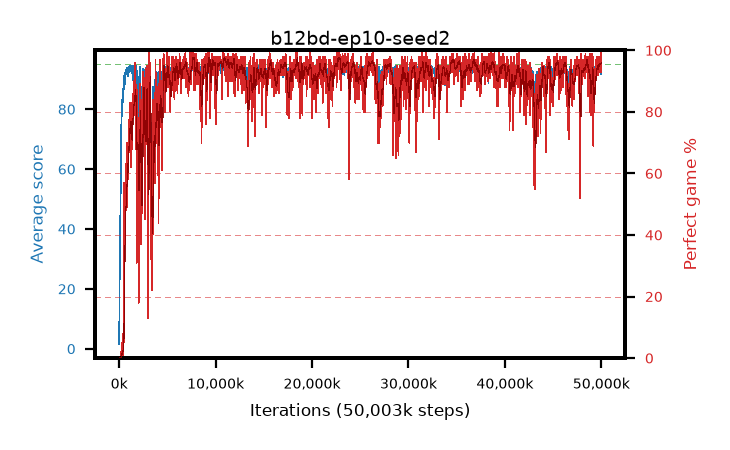

# b12bd-ep10-seed2

step **50,003,968** · 3052 evals · trailing **93.98** · peak **94.05** @48,709,632 · sef **90.8** · best30 **96.6** @22,872,064

## Config

| | |
|---|---|
| algo | ppo |
| collect_envs | 128 |
| discount | 0.99 |
| eval_interval | 16384 |
| eval_queue | True |
| eval_queue_depth | 16 |
| eval_workers | 8 |
| fc_layers | (320,) |
| graph_eval_episodes | 100 |
| max_steps | 50003968 |
| min_checkpoint_score | 40.0 |
| ppo_adam_epsilon | 1e-07 |
| ppo_anneal_fraction | 1.0 |
| ppo_clip | 0.2 |
| ppo_clip_final | None |
| ppo_entropy_coef | 0.01 |
| ppo_entropy_coef_final | None |
| ppo_epochs | 10 |
| ppo_gae_lambda | 0.99 |
| ppo_gradient_clipping | 0.5 |
| ppo_horizon | 50.3 |
| ppo_learning_rate | 0.0003 |
| ppo_learning_rate_final | None |
| ppo_minibatch | 256 |
| ppo_normalize_adv | True |
| ppo_rollout | 128 |
| ppo_target_kl | 0.0 |
| ppo_transitions_per_rollout | 16384 |
| ppo_value_loss | huber |
| ppo_vf_coef | 0.5 |
| seed | 2 |
| torch_threads | 1 |

## Evals

| step | avg score | trailing avg | min score | max score | avg reward | perfect % | epsilon |
|---|---|---|---|---|---|---|---|
| 16384 | 1.55 | 1.55 | 0.0 | 4.0 | -1.38 | 0.0 |  |
| 32768 | 18.68 | 10.12 | 7.0 | 41.0 | 13.95 | 0.0 |  |
| 49152 | 27.42 | 18.62 | 6.0 | 58.0 | 22.465 | 0.0 |  |
| ... | ... | ... | ... | ... | ... | ... | ... |
| 49823744 | 94.21 | 93.78 | 50.0 | 95.0 | 190.18 | 97.0 |  |
| 49840128 | 94.7 | 93.79 | 81.0 | 95.0 | 190.625 | 97.0 |  |
| 49856512 | 94.32 | 93.82 | 75.0 | 95.0 | 187.305 | 94.0 |  |
| 49872896 | 94.37 | 93.89 | 59.0 | 95.0 | 188.35 | 95.0 |  |
| 49889280 | 93.11 | 93.9 | 1.0 | 95.0 | 188.085 | 96.0 |  |
| 49905664 | 94.06 | 93.87 | 41.0 | 95.0 | 188.9 | 96.0 |  |
| 49922048 | 94.84 | 93.93 | 79.0 | 95.0 | 192.8 | 99.0 |  |
| 49938432 | 91.59 | 93.88 | 5.0 | 95.0 | 185.57 | 95.0 |  |
| 49954816 | 93.45 | 93.93 | 7.0 | 95.0 | 187.385 | 95.0 |  |
| 49971200 | 94.06 | 93.94 | 50.0 | 95.0 | 185.96 | 93.0 |  |
| 49987584 | 94.68 | 93.96 | 73.0 | 95.0 | 191.645 | 98.0 |  |
| 50003968 | 94.77 | 93.98 | 72.0 | 95.0 | 192.775 | 99.0 |  |
