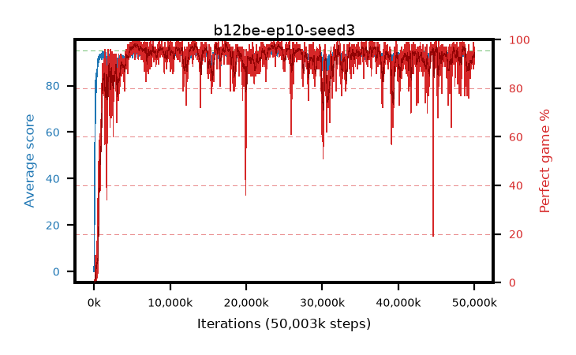

# b12be-ep10-seed3

step **50,003,968** · 3052 evals · trailing **93.23** · peak **94.37** @5,570,560 · sef **93.4** · best30 **97.9** @5,685,248

## Config

| | |
|---|---|
| algo | ppo |
| collect_envs | 128 |
| discount | 0.99 |
| eval_interval | 16384 |
| eval_queue | True |
| eval_queue_depth | 16 |
| eval_workers | 8 |
| fc_layers | (320,) |
| graph_eval_episodes | 100 |
| max_steps | 50003968 |
| min_checkpoint_score | 40.0 |
| ppo_adam_epsilon | 1e-07 |
| ppo_anneal_fraction | 1.0 |
| ppo_clip | 0.2 |
| ppo_clip_final | None |
| ppo_entropy_coef | 0.01 |
| ppo_entropy_coef_final | None |
| ppo_epochs | 10 |
| ppo_gae_lambda | 0.99 |
| ppo_gradient_clipping | 0.5 |
| ppo_horizon | 50.3 |
| ppo_learning_rate | 0.0003 |
| ppo_learning_rate_final | None |
| ppo_minibatch | 256 |
| ppo_normalize_adv | True |
| ppo_rollout | 128 |
| ppo_target_kl | 0.0 |
| ppo_transitions_per_rollout | 16384 |
| ppo_value_loss | huber |
| ppo_vf_coef | 0.5 |
| seed | 3 |
| torch_threads | 1 |

## Evals

| step | avg score | trailing avg | min score | max score | avg reward | perfect % | epsilon |
|---|---|---|---|---|---|---|---|
| 16384 | 0.05 | 0.05 | 0.0 | 2.0 | -4.005 | 0.0 |  |
| 32768 | 3.86 | 15.8 | 0.0 | 16.0 | 3.09 | 0.0 |  |
| 49152 | 28.35 | 14.2 | 4.0 | 49.0 | 23.35 | 0.0 |  |
| ... | ... | ... | ... | ... | ... | ... | ... |
| 49823744 | 93.55 | 92.78 | 39.0 | 95.0 | 180.295 | 88.0 |  |
| 49840128 | 92.84 | 92.82 | 3.0 | 95.0 | 181.53 | 90.0 |  |
| 49856512 | 94.92 | 92.97 | 87.0 | 95.0 | 192.925 | 99.0 |  |
| 49872896 | 93.57 | 92.81 | 1.0 | 95.0 | 188.5 | 96.0 |  |
| 49889280 | 94.74 | 93.08 | 79.0 | 95.0 | 190.71 | 97.0 |  |
| 49905664 | 94.29 | 93.11 | 61.0 | 95.0 | 189.13 | 96.0 |  |
| 49922048 | 91.54 | 93.06 | 6.0 | 95.0 | 181.36 | 91.0 |  |
| 49938432 | 92.37 | 93.12 | 42.0 | 95.0 | 181.15 | 90.0 |  |
| 49954816 | 92.65 | 93.31 | 41.0 | 95.0 | 181.475 | 90.0 |  |
| 49971200 | 94.12 | 93.3 | 38.0 | 95.0 | 190.045 | 97.0 |  |
| 49987584 | 94.35 | 93.11 | 61.0 | 95.0 | 190.365 | 97.0 |  |
| 50003968 | 92.83 | 93.23 | 12.0 | 95.0 | 186.81 | 95.0 |  |
