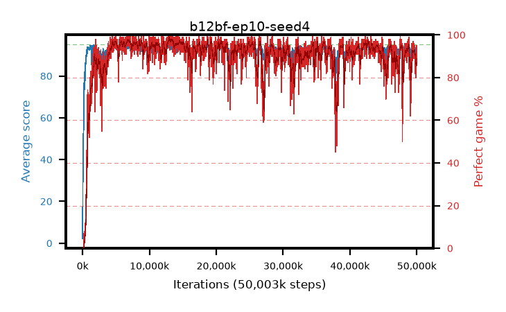

# b12bf-ep10-seed4

step **50,003,968** · 3052 evals · trailing **92.15** · peak **94.37** @12,976,128 · sef **91.8** · best30 **97.8** @13,271,040

## Config

| | |
|---|---|
| algo | ppo |
| collect_envs | 128 |
| discount | 0.99 |
| eval_interval | 16384 |
| eval_queue | True |
| eval_queue_depth | 16 |
| eval_workers | 8 |
| fc_layers | (320,) |
| graph_eval_episodes | 100 |
| max_steps | 50003968 |
| min_checkpoint_score | 40.0 |
| ppo_adam_epsilon | 1e-07 |
| ppo_anneal_fraction | 1.0 |
| ppo_clip | 0.2 |
| ppo_clip_final | None |
| ppo_entropy_coef | 0.01 |
| ppo_entropy_coef_final | None |
| ppo_epochs | 10 |
| ppo_gae_lambda | 0.99 |
| ppo_gradient_clipping | 0.5 |
| ppo_horizon | 50.3 |
| ppo_learning_rate | 0.0003 |
| ppo_learning_rate_final | None |
| ppo_minibatch | 256 |
| ppo_normalize_adv | True |
| ppo_rollout | 128 |
| ppo_target_kl | 0.0 |
| ppo_transitions_per_rollout | 16384 |
| ppo_value_loss | huber |
| ppo_vf_coef | 0.5 |
| seed | 4 |
| torch_threads | 1 |

## Evals

| step | avg score | trailing avg | min score | max score | avg reward | perfect % | epsilon |
|---|---|---|---|---|---|---|---|
| 16384 | 2.21 | 2.21 | 0.0 | 7.0 | -2.7 | 0.0 |  |
| 32768 | 27.52 | 14.87 | 3.0 | 51.0 | 22.61 | 0.0 |  |
| 49152 | 30.42 | 20.05 | 5.0 | 62.0 | 25.42 | 0.0 |  |
| ... | ... | ... | ... | ... | ... | ... | ... |
| 49823744 | 90.34 | 92.33 | 10.0 | 95.0 | 169.08 | 80.0 |  |
| 49840128 | 89.51 | 92.47 | 18.0 | 95.0 | 168.07 | 80.0 |  |
| 49856512 | 91.7 | 92.3 | 22.0 | 95.0 | 177.495 | 87.0 |  |
| 49872896 | 93.35 | 92.32 | 54.0 | 95.0 | 182.13 | 90.0 |  |
| 49889280 | 89.38 | 92.26 | 12.0 | 95.0 | 171.195 | 83.0 |  |
| 49905664 | 90.37 | 92.17 | 16.0 | 95.0 | 173.09 | 84.0 |  |
| 49922048 | 91.79 | 92.09 | 41.0 | 95.0 | 176.32 | 86.0 |  |
| 49938432 | 90.57 | 92.02 | 4.0 | 95.0 | 177.36 | 88.0 |  |
| 49954816 | 92.69 | 92.1 | 38.0 | 95.0 | 182.465 | 91.0 |  |
| 49971200 | 93.45 | 92.01 | 60.0 | 95.0 | 184.22 | 92.0 |  |
| 49987584 | 93.72 | 92.04 | 55.0 | 95.0 | 184.535 | 92.0 |  |
| 50003968 | 93.83 | 92.15 | 41.0 | 95.0 | 187.765 | 95.0 |  |
