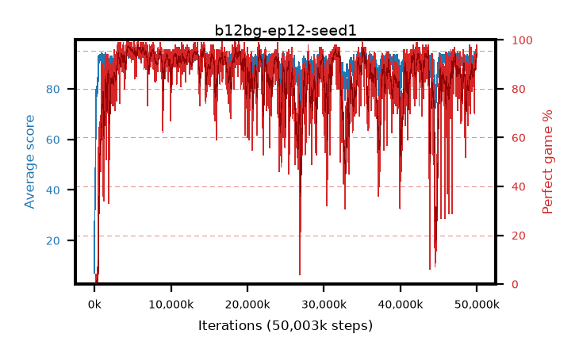

# b12bg-ep12-seed1

step **50,003,968** · 3052 evals · trailing **93.08** · peak **94.06** @5,914,624 · sef **74.5** · best30 **97.1** @4,685,824

## Config

| | |
|---|---|
| algo | ppo |
| collect_envs | 128 |
| discount | 0.99 |
| eval_interval | 16384 |
| eval_queue | True |
| eval_queue_depth | 16 |
| eval_workers | 8 |
| fc_layers | (320,) |
| graph_eval_episodes | 100 |
| max_steps | 50003968 |
| min_checkpoint_score | 40.0 |
| ppo_adam_epsilon | 1e-07 |
| ppo_anneal_fraction | 1.0 |
| ppo_clip | 0.2 |
| ppo_clip_final | None |
| ppo_entropy_coef | 0.01 |
| ppo_entropy_coef_final | None |
| ppo_epochs | 12 |
| ppo_gae_lambda | 0.99 |
| ppo_gradient_clipping | 0.5 |
| ppo_horizon | 50.3 |
| ppo_learning_rate | 0.0003 |
| ppo_learning_rate_final | None |
| ppo_minibatch | 256 |
| ppo_normalize_adv | True |
| ppo_rollout | 128 |
| ppo_target_kl | 0.0 |
| ppo_transitions_per_rollout | 16384 |
| ppo_value_loss | huber |
| ppo_vf_coef | 0.5 |
| seed | 1 |
| torch_threads | 1 |

## Evals

| step | avg score | trailing avg | min score | max score | avg reward | perfect % | epsilon |
|---|---|---|---|---|---|---|---|
| 16384 | 7.15 | 7.15 | 1.0 | 25.0 | 3.365 | 0.0 |  |
| 32768 | 41.83 | 28.87 | 6.0 | 73.0 | 36.875 | 0.0 |  |
| 49152 | 32.26 | 19.7 | 2.0 | 69.0 | 27.26 | 0.0 |  |
| ... | ... | ... | ... | ... | ... | ... | ... |
| 49823744 | 94.17 | 92.36 | 55.0 | 95.0 | 188.06 | 95.0 |  |
| 49840128 | 92.98 | 92.55 | 14.0 | 95.0 | 183.975 | 92.0 |  |
| 49856512 | 93.49 | 92.45 | 20.0 | 95.0 | 187.47 | 95.0 |  |
| 49872896 | 94.36 | 92.5 | 68.0 | 95.0 | 188.385 | 95.0 |  |
| 49889280 | 93.78 | 92.68 | 17.0 | 95.0 | 180.435 | 88.0 |  |
| 49905664 | 93.8 | 92.93 | 12.0 | 95.0 | 188.775 | 96.0 |  |
| 49922048 | 94.47 | 93.2 | 83.0 | 95.0 | 187.41 | 94.0 |  |
| 49938432 | 92.61 | 92.81 | 3.0 | 95.0 | 184.6 | 93.0 |  |
| 49954816 | 94.08 | 92.97 | 62.0 | 95.0 | 188.06 | 95.0 |  |
| 49971200 | 94.6 | 92.77 | 66.0 | 95.0 | 190.615 | 97.0 |  |
| 49987584 | 94.59 | 92.82 | 57.0 | 95.0 | 191.555 | 98.0 |  |
| 50003968 | 93.93 | 93.08 | 63.0 | 95.0 | 187.955 | 95.0 |  |
