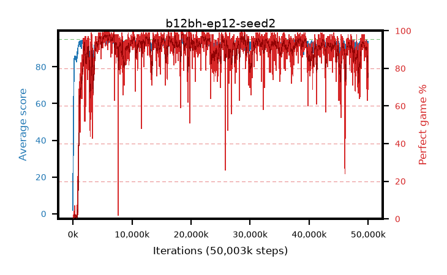

# b12bh-ep12-seed2

step **50,003,968** · 3052 evals · trailing **91.81** · peak **94.42** @6,406,144 · sef **90.0** · best30 **97.2** @5,685,248

## Config

| | |
|---|---|
| algo | ppo |
| collect_envs | 128 |
| discount | 0.99 |
| eval_interval | 16384 |
| eval_queue | True |
| eval_queue_depth | 16 |
| eval_workers | 8 |
| fc_layers | (320,) |
| graph_eval_episodes | 100 |
| max_steps | 50003968 |
| min_checkpoint_score | 40.0 |
| ppo_adam_epsilon | 1e-07 |
| ppo_anneal_fraction | 1.0 |
| ppo_clip | 0.2 |
| ppo_clip_final | None |
| ppo_entropy_coef | 0.01 |
| ppo_entropy_coef_final | None |
| ppo_epochs | 12 |
| ppo_gae_lambda | 0.99 |
| ppo_gradient_clipping | 0.5 |
| ppo_horizon | 50.3 |
| ppo_learning_rate | 0.0003 |
| ppo_learning_rate_final | None |
| ppo_minibatch | 256 |
| ppo_normalize_adv | True |
| ppo_rollout | 128 |
| ppo_target_kl | 0.0 |
| ppo_transitions_per_rollout | 16384 |
| ppo_value_loss | huber |
| ppo_vf_coef | 0.5 |
| seed | 2 |
| torch_threads | 1 |

## Evals

| step | avg score | trailing avg | min score | max score | avg reward | perfect % | epsilon |
|---|---|---|---|---|---|---|---|
| 16384 | 1.88 | 1.88 | 0.0 | 5.0 | -1.815 | 0.0 |  |
| 32768 | 35.39 | 23.16 | 11.0 | 67.0 | 30.48 | 0.0 |  |
| 49152 | 32.21 | 17.05 | 8.0 | 62.0 | 27.21 | 0.0 |  |
| ... | ... | ... | ... | ... | ... | ... | ... |
| 49823744 | 92.02 | 92.7 | 13.0 | 95.0 | 179.895 | 89.0 |  |
| 49840128 | 91.83 | 92.58 | 22.0 | 95.0 | 179.57 | 89.0 |  |
| 49856512 | 89.44 | 92.61 | 15.0 | 95.0 | 169.085 | 81.0 |  |
| 49872896 | 88.79 | 92.12 | 28.0 | 95.0 | 151.66 | 65.0 |  |
| 49889280 | 85.43 | 92.28 | 12.0 | 95.0 | 146.22 | 63.0 |  |
| 49905664 | 89.35 | 92.04 | 33.0 | 95.0 | 155.385 | 68.0 |  |
| 49922048 | 85.7 | 91.79 | 20.0 | 95.0 | 147.53 | 64.0 |  |
| 49938432 | 91.18 | 91.76 | 33.0 | 95.0 | 173.765 | 84.0 |  |
| 49954816 | 92.27 | 92.14 | 64.0 | 95.0 | 173.725 | 83.0 |  |
| 49971200 | 90.96 | 91.78 | 17.0 | 95.0 | 170.335 | 81.0 |  |
| 49987584 | 92.4 | 92.18 | 22.0 | 95.0 | 184.165 | 93.0 |  |
| 50003968 | 93.71 | 91.81 | 33.0 | 95.0 | 184.39 | 92.0 |  |
