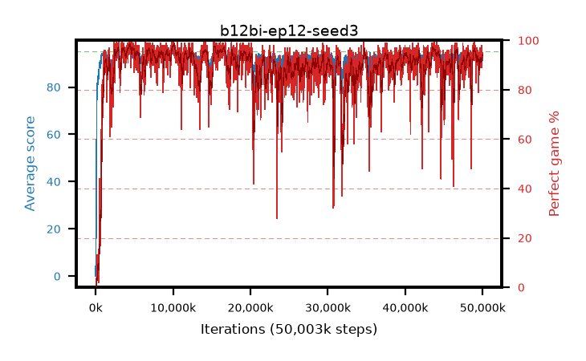

# b12bi-ep12-seed3

step **50,003,968** · 3052 evals · trailing **93.01** · peak **94.36** @10,272,768 · sef **89.9** · best30 **97.7** @10,174,464

## Config

| | |
|---|---|
| algo | ppo |
| collect_envs | 128 |
| discount | 0.99 |
| eval_interval | 16384 |
| eval_queue | True |
| eval_queue_depth | 16 |
| eval_workers | 8 |
| fc_layers | (320,) |
| graph_eval_episodes | 100 |
| max_steps | 50003968 |
| min_checkpoint_score | 40.0 |
| ppo_adam_epsilon | 1e-07 |
| ppo_anneal_fraction | 1.0 |
| ppo_clip | 0.2 |
| ppo_clip_final | None |
| ppo_entropy_coef | 0.01 |
| ppo_entropy_coef_final | None |
| ppo_epochs | 12 |
| ppo_gae_lambda | 0.99 |
| ppo_gradient_clipping | 0.5 |
| ppo_horizon | 50.3 |
| ppo_learning_rate | 0.0003 |
| ppo_learning_rate_final | None |
| ppo_minibatch | 256 |
| ppo_normalize_adv | True |
| ppo_rollout | 128 |
| ppo_target_kl | 0.0 |
| ppo_transitions_per_rollout | 16384 |
| ppo_value_loss | huber |
| ppo_vf_coef | 0.5 |
| seed | 3 |
| torch_threads | 1 |

## Evals

| step | avg score | trailing avg | min score | max score | avg reward | perfect % | epsilon |
|---|---|---|---|---|---|---|---|
| 16384 | 0.05 | 0.05 | 0.0 | 1.0 | -1.26 | 0.0 |  |
| 32768 | 7.33 | 15.99 | 0.0 | 23.0 | 5.345 | 0.0 |  |
| 49152 | 20.37 | 10.21 | 3.0 | 36.0 | 15.415 | 0.0 |  |
| ... | ... | ... | ... | ... | ... | ... | ... |
| 49823744 | 93.42 | 92.66 | 25.0 | 95.0 | 187.31 | 95.0 |  |
| 49840128 | 91.25 | 92.84 | 25.0 | 95.0 | 178.945 | 89.0 |  |
| 49856512 | 93.12 | 92.3 | 30.0 | 95.0 | 186.965 | 95.0 |  |
| 49872896 | 94.32 | 92.46 | 65.0 | 95.0 | 190.29 | 97.0 |  |
| 49889280 | 93.9 | 92.28 | 14.0 | 95.0 | 190.82 | 98.0 |  |
| 49905664 | 92.92 | 92.5 | 63.0 | 95.0 | 181.79 | 90.0 |  |
| 49922048 | 93.11 | 92.51 | 23.0 | 95.0 | 186.955 | 95.0 |  |
| 49938432 | 91.38 | 92.47 | 11.0 | 95.0 | 183.145 | 93.0 |  |
| 49954816 | 93.54 | 92.52 | 34.0 | 95.0 | 186.345 | 94.0 |  |
| 49971200 | 93.24 | 92.73 | 24.0 | 95.0 | 186.135 | 94.0 |  |
| 49987584 | 93.54 | 93.07 | 11.0 | 95.0 | 186.39 | 94.0 |  |
| 50003968 | 94.28 | 93.01 | 75.0 | 95.0 | 188.26 | 95.0 |  |
