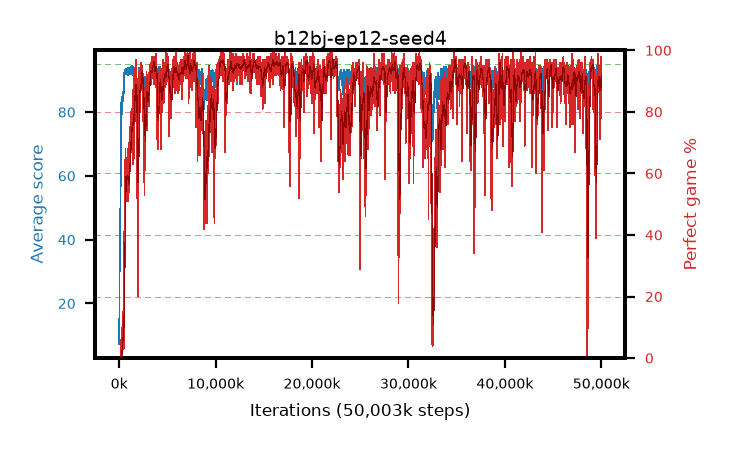

# b12bj-ep12-seed4

step **50,003,968** · 3052 evals · trailing **92.78** · peak **94.18** @16,334,848 · sef **80.9** · best30 **96.4** @7,143,424

## Config

| | |
|---|---|
| algo | ppo |
| collect_envs | 128 |
| discount | 0.99 |
| eval_interval | 16384 |
| eval_queue | True |
| eval_queue_depth | 16 |
| eval_workers | 8 |
| fc_layers | (320,) |
| graph_eval_episodes | 100 |
| max_steps | 50003968 |
| min_checkpoint_score | 40.0 |
| ppo_adam_epsilon | 1e-07 |
| ppo_anneal_fraction | 1.0 |
| ppo_clip | 0.2 |
| ppo_clip_final | None |
| ppo_entropy_coef | 0.01 |
| ppo_entropy_coef_final | None |
| ppo_epochs | 12 |
| ppo_gae_lambda | 0.99 |
| ppo_gradient_clipping | 0.5 |
| ppo_horizon | 50.3 |
| ppo_learning_rate | 0.0003 |
| ppo_learning_rate_final | None |
| ppo_minibatch | 256 |
| ppo_normalize_adv | True |
| ppo_rollout | 128 |
| ppo_target_kl | 0.0 |
| ppo_transitions_per_rollout | 16384 |
| ppo_value_loss | huber |
| ppo_vf_coef | 0.5 |
| seed | 4 |
| torch_threads | 1 |

## Evals

| step | avg score | trailing avg | min score | max score | avg reward | perfect % | epsilon |
|---|---|---|---|---|---|---|---|
| 16384 | 7.25 | 7.25 | 1.0 | 19.0 | 2.43 | 0.0 |  |
| 32768 | 27.87 | 21.78 | 2.0 | 51.0 | 23.23 | 0.0 |  |
| 49152 | 34.37 | 24.93 | 2.0 | 65.0 | 29.37 | 0.0 |  |
| ... | ... | ... | ... | ... | ... | ... | ... |
| 49823744 | 89.58 | 91.92 | 20.0 | 95.0 | 158.69 | 71.0 |  |
| 49840128 | 92.53 | 92.11 | 65.0 | 95.0 | 176.29 | 85.0 |  |
| 49856512 | 94.41 | 91.5 | 77.0 | 95.0 | 186.175 | 93.0 |  |
| 49872896 | 94.08 | 91.55 | 77.0 | 95.0 | 185.89 | 93.0 |  |
| 49889280 | 94.12 | 91.71 | 77.0 | 95.0 | 183.985 | 91.0 |  |
| 49905664 | 91.98 | 92.53 | 10.0 | 95.0 | 178.95 | 88.0 |  |
| 49922048 | 92.31 | 92.03 | 1.0 | 95.0 | 182.31 | 91.0 |  |
| 49938432 | 94.24 | 93.0 | 71.0 | 95.0 | 182.975 | 90.0 |  |
| 49954816 | 93.67 | 93.1 | 6.0 | 95.0 | 184.575 | 92.0 |  |
| 49971200 | 92.39 | 92.4 | 5.0 | 95.0 | 187.365 | 96.0 |  |
| 49987584 | 94.87 | 93.16 | 88.0 | 95.0 | 191.88 | 98.0 |  |
| 50003968 | 93.31 | 92.78 | 7.0 | 95.0 | 169.7 | 78.0 |  |
