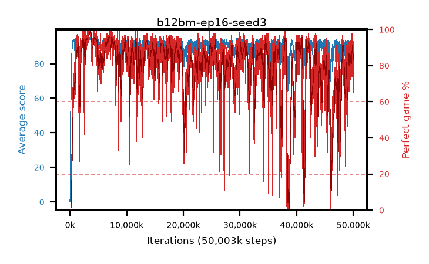

# b12bm-ep16-seed3

step **50,003,968** · 3052 evals · trailing **91.89** · peak **94.38** @3,604,480 · sef **63.1** · best30 **97.9** @3,604,480

## Config

| | |
|---|---|
| algo | ppo |
| collect_envs | 128 |
| discount | 0.99 |
| eval_interval | 16384 |
| eval_queue | True |
| eval_queue_depth | 16 |
| eval_workers | 8 |
| fc_layers | (320,) |
| graph_eval_episodes | 100 |
| max_steps | 50003968 |
| min_checkpoint_score | 40.0 |
| ppo_adam_epsilon | 1e-07 |
| ppo_anneal_fraction | 1.0 |
| ppo_clip | 0.2 |
| ppo_clip_final | None |
| ppo_entropy_coef | 0.01 |
| ppo_entropy_coef_final | None |
| ppo_epochs | 16 |
| ppo_gae_lambda | 0.99 |
| ppo_gradient_clipping | 0.5 |
| ppo_horizon | 50.3 |
| ppo_learning_rate | 0.0003 |
| ppo_learning_rate_final | None |
| ppo_minibatch | 256 |
| ppo_normalize_adv | True |
| ppo_rollout | 128 |
| ppo_target_kl | 0.0 |
| ppo_transitions_per_rollout | 16384 |
| ppo_value_loss | huber |
| ppo_vf_coef | 0.5 |
| seed | 3 |
| torch_threads | 1 |

## Evals

| step | avg score | trailing avg | min score | max score | avg reward | perfect % | epsilon |
|---|---|---|---|---|---|---|---|
| 16384 | 0.04 | 0.04 | 0.0 | 1.0 | -4.51 | 0.0 |  |
| 32768 | 2.13 | 1.08 | 0.0 | 9.0 | 1.405 | 0.0 |  |
| 49152 | 19.58 | 7.25 | 6.0 | 35.0 | 14.67 | 0.0 |  |
| ... | ... | ... | ... | ... | ... | ... | ... |
| 49823744 | 93.9 | 91.81 | 12.0 | 95.0 | 187.7 | 95.0 |  |
| 49840128 | 93.84 | 91.9 | 7.0 | 95.0 | 189.81 | 97.0 |  |
| 49856512 | 92.44 | 92.05 | 10.0 | 95.0 | 180.135 | 89.0 |  |
| 49872896 | 93.25 | 91.97 | 55.0 | 95.0 | 185.015 | 93.0 |  |
| 49889280 | 93.22 | 92.03 | 36.0 | 95.0 | 183.99 | 92.0 |  |
| 49905664 | 92.64 | 92.16 | 56.0 | 95.0 | 177.305 | 86.0 |  |
| 49922048 | 92.13 | 92.19 | 71.0 | 95.0 | 167.3 | 77.0 |  |
| 49938432 | 81.98 | 91.83 | 6.0 | 95.0 | 144.625 | 65.0 |  |
| 49954816 | 91.75 | 92.15 | 37.0 | 95.0 | 171.125 | 81.0 |  |
| 49971200 | 91.59 | 91.8 | 37.0 | 95.0 | 172.955 | 83.0 |  |
| 49987584 | 90.7 | 91.75 | 30.0 | 95.0 | 171.07 | 82.0 |  |
| 50003968 | 92.79 | 91.89 | 46.0 | 95.0 | 177.41 | 86.0 |  |
