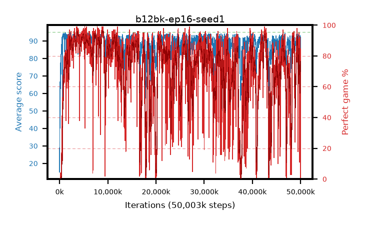

# b12bk-ep16-seed1

step **50,003,968** · 3052 evals · trailing **88.74** · peak **93.79** @9,093,120 · sef **49.8** · best30 **95.6** @9,142,272

## Config

| | |
|---|---|
| algo | ppo |
| collect_envs | 128 |
| discount | 0.99 |
| eval_interval | 16384 |
| eval_queue | True |
| eval_queue_depth | 16 |
| eval_workers | 8 |
| fc_layers | (320,) |
| graph_eval_episodes | 100 |
| max_steps | 50003968 |
| min_checkpoint_score | 40.0 |
| ppo_adam_epsilon | 1e-07 |
| ppo_anneal_fraction | 1.0 |
| ppo_clip | 0.2 |
| ppo_clip_final | None |
| ppo_entropy_coef | 0.01 |
| ppo_entropy_coef_final | None |
| ppo_epochs | 16 |
| ppo_gae_lambda | 0.99 |
| ppo_gradient_clipping | 0.5 |
| ppo_horizon | 50.3 |
| ppo_learning_rate | 0.0003 |
| ppo_learning_rate_final | None |
| ppo_minibatch | 256 |
| ppo_normalize_adv | True |
| ppo_rollout | 128 |
| ppo_target_kl | 0.0 |
| ppo_transitions_per_rollout | 16384 |
| ppo_value_loss | huber |
| ppo_vf_coef | 0.5 |
| seed | 1 |
| torch_threads | 1 |

## Evals

| step | avg score | trailing avg | min score | max score | avg reward | perfect % | epsilon |
|---|---|---|---|---|---|---|---|
| 16384 | 15.05 | 15.05 | 3.0 | 30.0 | 10.41 | 0.0 |  |
| 32768 | 38.19 | 26.62 | 2.0 | 66.0 | 33.415 | 0.0 |  |
| 49152 | 41.05 | 31.43 | 14.0 | 68.0 | 36.05 | 0.0 |  |
| ... | ... | ... | ... | ... | ... | ... | ... |
| 49823744 | 86.83 | 88.67 | 26.0 | 95.0 | 138.125 | 54.0 |  |
| 49840128 | 87.28 | 88.45 | 26.0 | 95.0 | 143.685 | 59.0 |  |
| 49856512 | 91.12 | 88.45 | 49.0 | 95.0 | 163.08 | 74.0 |  |
| 49872896 | 92.49 | 88.52 | 62.0 | 95.0 | 171.775 | 81.0 |  |
| 49889280 | 92.25 | 88.65 | 62.0 | 95.0 | 173.93 | 83.0 |  |
| 49905664 | 92.88 | 88.55 | 24.0 | 95.0 | 183.65 | 92.0 |  |
| 49922048 | 93.03 | 89.44 | 66.0 | 95.0 | 178.735 | 87.0 |  |
| 49938432 | 86.66 | 88.44 | 1.0 | 95.0 | 163.14 | 78.0 |  |
| 49954816 | 92.3 | 89.06 | 47.0 | 95.0 | 174.795 | 84.0 |  |
| 49971200 | 89.33 | 89.24 | 31.0 | 95.0 | 160.295 | 73.0 |  |
| 49987584 | 83.24 | 88.54 | 32.0 | 95.0 | 125.04 | 45.0 |  |
| 50003968 | 70.42 | 88.74 | 44.0 | 84.0 | 65.42 | 0.0 |  |
