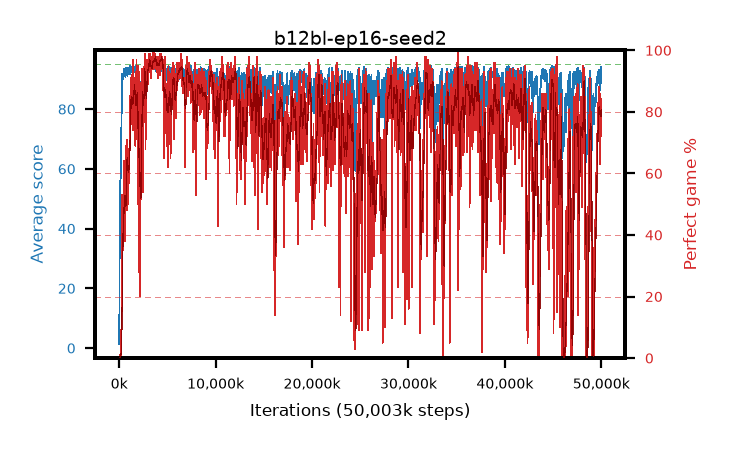

# b12bl-ep16-seed2

step **50,003,968** · 3052 evals · trailing **90.56** · peak **94.07** @3,964,928 · sef **50.2** · best30 **96.5** @3,948,544

## Config

| | |
|---|---|
| algo | ppo |
| collect_envs | 128 |
| discount | 0.99 |
| eval_interval | 16384 |
| eval_queue | True |
| eval_queue_depth | 16 |
| eval_workers | 8 |
| fc_layers | (320,) |
| graph_eval_episodes | 100 |
| max_steps | 50003968 |
| min_checkpoint_score | 40.0 |
| ppo_adam_epsilon | 1e-07 |
| ppo_anneal_fraction | 1.0 |
| ppo_clip | 0.2 |
| ppo_clip_final | None |
| ppo_entropy_coef | 0.01 |
| ppo_entropy_coef_final | None |
| ppo_epochs | 16 |
| ppo_gae_lambda | 0.99 |
| ppo_gradient_clipping | 0.5 |
| ppo_horizon | 50.3 |
| ppo_learning_rate | 0.0003 |
| ppo_learning_rate_final | None |
| ppo_minibatch | 256 |
| ppo_normalize_adv | True |
| ppo_rollout | 128 |
| ppo_target_kl | 0.0 |
| ppo_transitions_per_rollout | 16384 |
| ppo_value_loss | huber |
| ppo_vf_coef | 0.5 |
| seed | 2 |
| torch_threads | 1 |

## Evals

| step | avg score | trailing avg | min score | max score | avg reward | perfect % | epsilon |
|---|---|---|---|---|---|---|---|
| 16384 | 1.33 | 1.33 | 0.0 | 4.0 | -1.195 | 0.0 |  |
| 32768 | 21.41 | 19.45 | 0.0 | 47.0 | 18.345 | 0.0 |  |
| 49152 | 35.61 | 18.47 | 11.0 | 57.0 | 30.61 | 0.0 |  |
| ... | ... | ... | ... | ... | ... | ... | ... |
| 49823744 | 90.67 | 88.48 | 36.0 | 95.0 | 161.585 | 72.0 |  |
| 49840128 | 86.26 | 87.98 | 8.0 | 95.0 | 147.86 | 63.0 |  |
| 49856512 | 90.97 | 88.79 | 60.0 | 95.0 | 170.84 | 81.0 |  |
| 49872896 | 91.67 | 88.25 | 18.0 | 95.0 | 173.395 | 83.0 |  |
| 49889280 | 91.75 | 89.46 | 54.0 | 95.0 | 173.655 | 83.0 |  |
| 49905664 | 91.81 | 89.15 | 7.0 | 95.0 | 176.79 | 86.0 |  |
| 49922048 | 91.34 | 90.35 | 27.0 | 95.0 | 175.01 | 85.0 |  |
| 49938432 | 94.1 | 90.05 | 72.0 | 95.0 | 174.425 | 82.0 |  |
| 49954816 | 91.33 | 90.67 | 53.0 | 95.0 | 162.565 | 73.0 |  |
| 49971200 | 91.4 | 90.57 | 45.0 | 95.0 | 173.895 | 84.0 |  |
| 49987584 | 89.28 | 90.46 | 38.0 | 95.0 | 164.45 | 77.0 |  |
| 50003968 | 88.63 | 90.56 | 14.0 | 95.0 | 158.555 | 72.0 |  |
