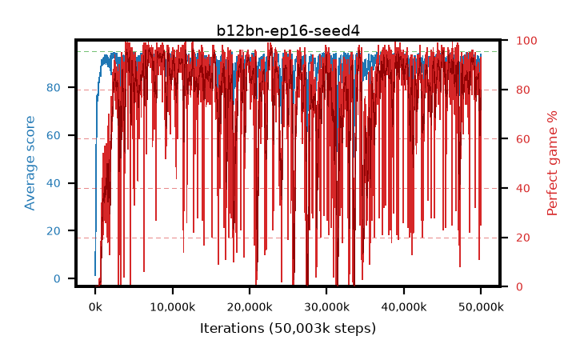

# b12bn-ep16-seed4

step **50,003,968** · 3052 evals · trailing **90.31** · peak **93.86** @22,937,600 · sef **63.8** · best30 **95.0** @7,225,344

## Config

| | |
|---|---|
| algo | ppo |
| collect_envs | 128 |
| discount | 0.99 |
| eval_interval | 16384 |
| eval_queue | True |
| eval_queue_depth | 16 |
| eval_workers | 8 |
| fc_layers | (320,) |
| graph_eval_episodes | 100 |
| max_steps | 50003968 |
| min_checkpoint_score | 40.0 |
| ppo_adam_epsilon | 1e-07 |
| ppo_anneal_fraction | 1.0 |
| ppo_clip | 0.2 |
| ppo_clip_final | None |
| ppo_entropy_coef | 0.01 |
| ppo_entropy_coef_final | None |
| ppo_epochs | 16 |
| ppo_gae_lambda | 0.99 |
| ppo_gradient_clipping | 0.5 |
| ppo_horizon | 50.3 |
| ppo_learning_rate | 0.0003 |
| ppo_learning_rate_final | None |
| ppo_minibatch | 256 |
| ppo_normalize_adv | True |
| ppo_rollout | 128 |
| ppo_target_kl | 0.0 |
| ppo_transitions_per_rollout | 16384 |
| ppo_value_loss | huber |
| ppo_vf_coef | 0.5 |
| seed | 4 |
| torch_threads | 1 |

## Evals

| step | avg score | trailing avg | min score | max score | avg reward | perfect % | epsilon |
|---|---|---|---|---|---|---|---|
| 16384 | 1.31 | 1.31 | 0.0 | 6.0 | -1.755 | 0.0 |  |
| 32768 | 17.72 | 9.51 | 2.0 | 37.0 | 13.17 | 0.0 |  |
| 49152 | 20.73 | 13.25 | 2.0 | 46.0 | 15.73 | 0.0 |  |
| ... | ... | ... | ... | ... | ... | ... | ... |
| 49823744 | 88.41 | 90.02 | 48.0 | 95.0 | 154.175 | 68.0 |  |
| 49840128 | 87.61 | 89.78 | 14.0 | 95.0 | 154.415 | 69.0 |  |
| 49856512 | 86.31 | 89.62 | 1.0 | 95.0 | 152.075 | 68.0 |  |
| 49872896 | 90.05 | 89.67 | 15.0 | 95.0 | 174.535 | 86.0 |  |
| 49889280 | 91.67 | 89.72 | 51.0 | 95.0 | 177.15 | 87.0 |  |
| 49905664 | 87.76 | 89.62 | 19.0 | 95.0 | 163.88 | 78.0 |  |
| 49922048 | 91.62 | 89.72 | 39.0 | 95.0 | 176.06 | 86.0 |  |
| 49938432 | 91.91 | 89.88 | 16.0 | 95.0 | 113.045 | 25.0 |  |
| 49954816 | 92.7 | 89.85 | 20.0 | 95.0 | 184.555 | 93.0 |  |
| 49971200 | 92.76 | 89.97 | 27.0 | 95.0 | 183.485 | 92.0 |  |
| 49987584 | 93.96 | 90.14 | 62.0 | 95.0 | 185.86 | 93.0 |  |
| 50003968 | 93.12 | 90.31 | 56.0 | 95.0 | 182.76 | 91.0 |  |
