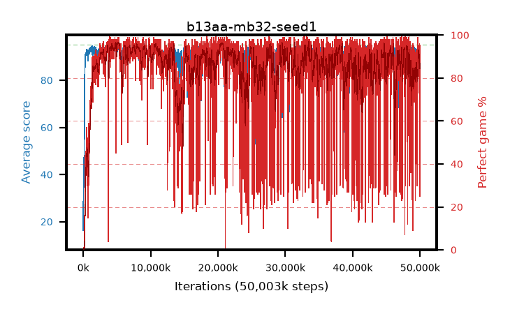

# b13aa-mb32-seed1

step **50,003,968** · 3052 evals · trailing **92.99** · peak **93.93** @33,472,512 · sef **82.5** · best30 **95.9** @5,373,952

## Config

| | |
|---|---|
| algo | ppo |
| collect_envs | 128 |
| discount | 0.99 |
| eval_interval | 16384 |
| eval_queue | True |
| eval_queue_depth | 16 |
| eval_workers | 8 |
| fc_layers | (320,) |
| graph_eval_episodes | 100 |
| max_steps | 50003968 |
| min_checkpoint_score | 40.0 |
| ppo_adam_epsilon | 1e-07 |
| ppo_anneal_fraction | 1.0 |
| ppo_clip | 0.2 |
| ppo_clip_final | None |
| ppo_entropy_coef | 0.01 |
| ppo_entropy_coef_final | None |
| ppo_epochs | 4 |
| ppo_gae_lambda | 0.99 |
| ppo_gradient_clipping | 0.5 |
| ppo_horizon | 50.3 |
| ppo_learning_rate | 0.0003 |
| ppo_learning_rate_final | None |
| ppo_minibatch | 32 |
| ppo_normalize_adv | True |
| ppo_rollout | 128 |
| ppo_target_kl | 0.0 |
| ppo_transitions_per_rollout | 16384 |
| ppo_value_loss | huber |
| ppo_vf_coef | 0.5 |
| seed | 1 |
| torch_threads | 1 |

## Evals

| step | avg score | trailing avg | min score | max score | avg reward | perfect % | epsilon |
|---|---|---|---|---|---|---|---|
| 16384 | 16.46 | 16.46 | 0.0 | 40.0 | 11.595 | 0.0 |  |
| 32768 | 36.76 | 26.61 | 13.0 | 69.0 | 31.85 | 0.0 |  |
| 49152 | 34.68 | 29.3 | 16.0 | 62.0 | 29.68 | 0.0 |  |
| ... | ... | ... | ... | ... | ... | ... | ... |
| 49823744 | 90.72 | 92.65 | 4.0 | 95.0 | 162.09 | 73.0 |  |
| 49840128 | 92.3 | 92.76 | 8.0 | 95.0 | 182.3 | 91.0 |  |
| 49856512 | 94.03 | 92.92 | 64.0 | 95.0 | 185.07 | 92.0 |  |
| 49872896 | 92.9 | 92.95 | 6.0 | 95.0 | 183.805 | 92.0 |  |
| 49889280 | 93.89 | 92.53 | 56.0 | 95.0 | 187.87 | 95.0 |  |
| 49905664 | 94.23 | 92.61 | 70.0 | 95.0 | 188.21 | 95.0 |  |
| 49922048 | 94.43 | 92.74 | 75.0 | 95.0 | 189.405 | 96.0 |  |
| 49938432 | 92.79 | 92.69 | 18.0 | 95.0 | 184.645 | 93.0 |  |
| 49954816 | 94.05 | 92.7 | 84.0 | 95.0 | 115.185 | 25.0 |  |
| 49971200 | 93.3 | 92.71 | 54.0 | 95.0 | 185.245 | 93.0 |  |
| 49987584 | 94.13 | 92.88 | 63.0 | 95.0 | 188.11 | 95.0 |  |
| 50003968 | 93.46 | 92.99 | 32.0 | 95.0 | 185.495 | 93.0 |  |
