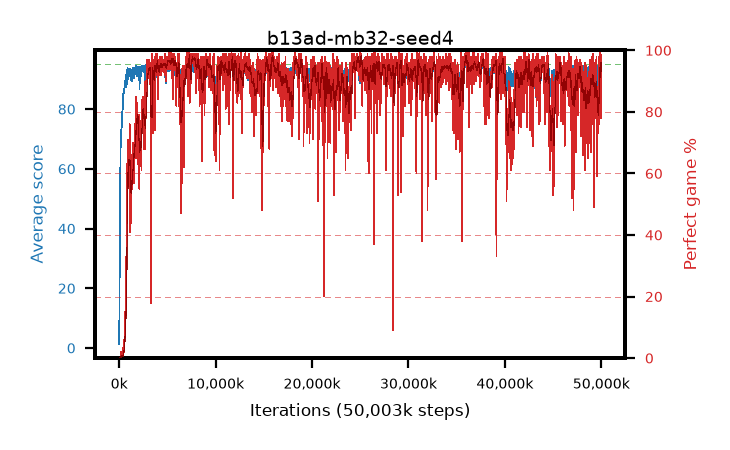

# b13ad-mb32-seed4

step **50,003,968** · 3052 evals · trailing **91.62** · peak **94.28** @8,028,160 · sef **87.1** · best30 **97.1** @7,897,088

## Config

| | |
|---|---|
| algo | ppo |
| collect_envs | 128 |
| discount | 0.99 |
| eval_interval | 16384 |
| eval_queue | True |
| eval_queue_depth | 16 |
| eval_workers | 8 |
| fc_layers | (320,) |
| graph_eval_episodes | 100 |
| max_steps | 50003968 |
| min_checkpoint_score | 40.0 |
| ppo_adam_epsilon | 1e-07 |
| ppo_anneal_fraction | 1.0 |
| ppo_clip | 0.2 |
| ppo_clip_final | None |
| ppo_entropy_coef | 0.01 |
| ppo_entropy_coef_final | None |
| ppo_epochs | 4 |
| ppo_gae_lambda | 0.99 |
| ppo_gradient_clipping | 0.5 |
| ppo_horizon | 50.3 |
| ppo_learning_rate | 0.0003 |
| ppo_learning_rate_final | None |
| ppo_minibatch | 32 |
| ppo_normalize_adv | True |
| ppo_rollout | 128 |
| ppo_target_kl | 0.0 |
| ppo_transitions_per_rollout | 16384 |
| ppo_value_loss | huber |
| ppo_vf_coef | 0.5 |
| seed | 4 |
| torch_threads | 1 |

## Evals

| step | avg score | trailing avg | min score | max score | avg reward | perfect % | epsilon |
|---|---|---|---|---|---|---|---|
| 16384 | 1.3 | 1.3 | 0.0 | 5.0 | -0.235 | 0.0 |  |
| 32768 | 14.4 | 7.85 | 0.0 | 34.0 | 10.345 | 0.0 |  |
| 49152 | 28.02 | 14.57 | 9.0 | 50.0 | 23.02 | 0.0 |  |
| ... | ... | ... | ... | ... | ... | ... | ... |
| 49823744 | 93.72 | 91.29 | 17.0 | 95.0 | 189.69 | 97.0 |  |
| 49840128 | 95.0 | 91.27 | 95.0 | 95.0 | 194.0 | 100.0 |  |
| 49856512 | 93.43 | 91.25 | 16.0 | 95.0 | 187.455 | 95.0 |  |
| 49872896 | 90.72 | 91.21 | 11.0 | 95.0 | 182.53 | 93.0 |  |
| 49889280 | 94.25 | 91.43 | 66.0 | 95.0 | 188.275 | 95.0 |  |
| 49905664 | 94.66 | 91.41 | 86.0 | 95.0 | 188.685 | 95.0 |  |
| 49922048 | 94.84 | 91.5 | 79.0 | 95.0 | 192.845 | 99.0 |  |
| 49938432 | 94.55 | 91.63 | 73.0 | 95.0 | 190.565 | 97.0 |  |
| 49954816 | 93.58 | 91.6 | 13.0 | 95.0 | 187.56 | 95.0 |  |
| 49971200 | 93.56 | 91.6 | 20.0 | 95.0 | 169.815 | 78.0 |  |
| 49987584 | 94.47 | 91.61 | 64.0 | 95.0 | 190.485 | 97.0 |  |
| 50003968 | 93.14 | 91.62 | 63.0 | 95.0 | 181.15 | 89.0 |  |
