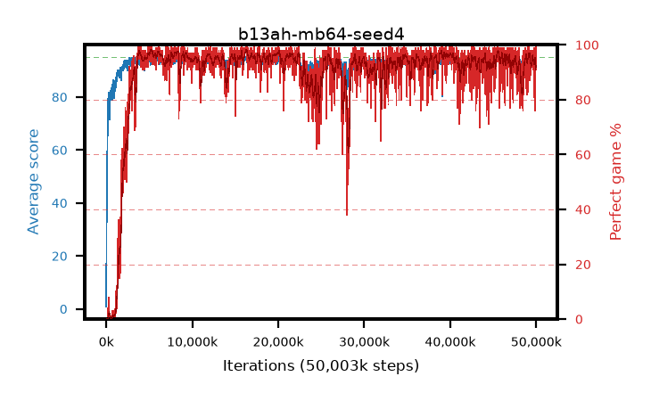

# b13ah-mb64-seed4

step **50,003,968** · 3052 evals · trailing **94.02** · peak **94.49** @45,547,520 · sef **91.1** · best30 **97.6** @5,292,032

## Config

| | |
|---|---|
| algo | ppo |
| collect_envs | 128 |
| discount | 0.99 |
| eval_interval | 16384 |
| eval_queue | True |
| eval_queue_depth | 16 |
| eval_workers | 8 |
| fc_layers | (320,) |
| graph_eval_episodes | 100 |
| max_steps | 50003968 |
| min_checkpoint_score | 40.0 |
| ppo_adam_epsilon | 1e-07 |
| ppo_anneal_fraction | 1.0 |
| ppo_clip | 0.2 |
| ppo_clip_final | None |
| ppo_entropy_coef | 0.01 |
| ppo_entropy_coef_final | None |
| ppo_epochs | 4 |
| ppo_gae_lambda | 0.99 |
| ppo_gradient_clipping | 0.5 |
| ppo_horizon | 50.3 |
| ppo_learning_rate | 0.0003 |
| ppo_learning_rate_final | None |
| ppo_minibatch | 64 |
| ppo_normalize_adv | True |
| ppo_rollout | 128 |
| ppo_target_kl | 0.0 |
| ppo_transitions_per_rollout | 16384 |
| ppo_value_loss | huber |
| ppo_vf_coef | 0.5 |
| seed | 4 |
| torch_threads | 1 |

## Evals

| step | avg score | trailing avg | min score | max score | avg reward | perfect % | epsilon |
|---|---|---|---|---|---|---|---|
| 16384 | 0.86 | 0.86 | 0.0 | 7.0 | 0.0 | 0.0 |  |
| 32768 | 28.14 | 14.5 | 5.0 | 58.0 | 23.365 | 0.0 |  |
| 49152 | 34.91 | 21.3 | 10.0 | 69.0 | 29.91 | 0.0 |  |
| ... | ... | ... | ... | ... | ... | ... | ... |
| 49823744 | 94.9 | 94.05 | 90.0 | 95.0 | 191.91 | 98.0 |  |
| 49840128 | 94.6 | 94.02 | 70.0 | 95.0 | 190.615 | 97.0 |  |
| 49856512 | 94.54 | 94.02 | 49.0 | 95.0 | 192.5 | 99.0 |  |
| 49872896 | 93.12 | 93.99 | 27.0 | 95.0 | 167.295 | 76.0 |  |
| 49889280 | 93.6 | 94.0 | 20.0 | 95.0 | 176.095 | 84.0 |  |
| 49905664 | 93.79 | 94.01 | 35.0 | 95.0 | 176.24 | 84.0 |  |
| 49922048 | 94.79 | 94.0 | 85.0 | 95.0 | 190.76 | 97.0 |  |
| 49938432 | 95.0 | 94.03 | 95.0 | 95.0 | 194.0 | 100.0 |  |
| 49954816 | 93.14 | 93.97 | 18.0 | 95.0 | 183.095 | 91.0 |  |
| 49971200 | 94.04 | 94.0 | 8.0 | 95.0 | 190.055 | 97.0 |  |
| 49987584 | 91.96 | 93.99 | 6.0 | 95.0 | 184.9 | 94.0 |  |
| 50003968 | 94.62 | 94.02 | 70.0 | 95.0 | 190.635 | 97.0 |  |
