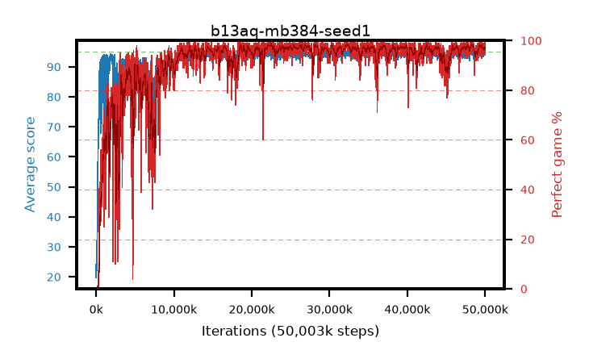

# b13aq-mb384-seed1

step **50,003,968** · 3052 evals · trailing **94.41** · peak **94.62** @28,573,696 · sef **90.0** · best30 **98.4** @22,495,232

## Config

| | |
|---|---|
| algo | ppo |
| collect_envs | 128 |
| discount | 0.99 |
| eval_interval | 16384 |
| eval_queue | True |
| eval_queue_depth | 16 |
| eval_workers | 8 |
| fc_layers | (320,) |
| graph_eval_episodes | 100 |
| max_steps | 50003968 |
| min_checkpoint_score | 40.0 |
| ppo_adam_epsilon | 1e-07 |
| ppo_anneal_fraction | 1.0 |
| ppo_clip | 0.2 |
| ppo_clip_final | None |
| ppo_entropy_coef | 0.01 |
| ppo_entropy_coef_final | None |
| ppo_epochs | 4 |
| ppo_gae_lambda | 0.99 |
| ppo_gradient_clipping | 0.5 |
| ppo_horizon | 50.3 |
| ppo_learning_rate | 0.0003 |
| ppo_learning_rate_final | None |
| ppo_minibatch | 384 |
| ppo_normalize_adv | True |
| ppo_rollout | 128 |
| ppo_target_kl | 0.0 |
| ppo_transitions_per_rollout | 16384 |
| ppo_value_loss | huber |
| ppo_vf_coef | 0.5 |
| seed | 1 |
| torch_threads | 1 |

## Evals

| step | avg score | trailing avg | min score | max score | avg reward | perfect % | epsilon |
|---|---|---|---|---|---|---|---|
| 16384 | 19.77 | 23.35 | 0.0 | 47.0 | 16.165 | 0.0 |  |
| 32768 | 27.22 | 24.85 | 11.0 | 48.0 | 22.22 | 0.0 |  |
| 49152 | 22.49 | 22.49 | 7.0 | 37.0 | 17.49 | 0.0 |  |
| ... | ... | ... | ... | ... | ... | ... | ... |
| 49823744 | 94.53 | 94.38 | 66.0 | 95.0 | 189.55 | 96.0 |  |
| 49840128 | 94.11 | 94.43 | 41.0 | 95.0 | 190.08 | 97.0 |  |
| 49856512 | 94.36 | 94.4 | 62.0 | 95.0 | 190.375 | 97.0 |  |
| 49872896 | 94.54 | 94.41 | 85.0 | 95.0 | 188.565 | 95.0 |  |
| 49889280 | 94.93 | 94.41 | 90.0 | 95.0 | 191.94 | 98.0 |  |
| 49905664 | 94.5 | 94.39 | 65.0 | 95.0 | 190.515 | 97.0 |  |
| 49922048 | 94.5 | 94.4 | 67.0 | 95.0 | 190.515 | 97.0 |  |
| 49938432 | 95.0 | 94.43 | 95.0 | 95.0 | 194.0 | 100.0 |  |
| 49954816 | 94.71 | 94.45 | 70.0 | 95.0 | 191.72 | 98.0 |  |
| 49971200 | 93.97 | 94.43 | 20.0 | 95.0 | 188.99 | 96.0 |  |
| 49987584 | 94.64 | 94.44 | 65.0 | 95.0 | 191.65 | 98.0 |  |
| 50003968 | 94.43 | 94.41 | 62.0 | 95.0 | 190.445 | 97.0 |  |
