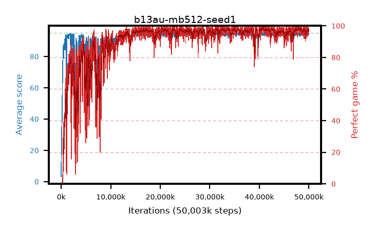

# b13au-mb512-seed1

step **50,003,968** · 3052 evals · trailing **94.36** · peak **94.62** @41,877,504 · sef **87.6** · best30 **98.3** @40,747,008

## Config

| | |
|---|---|
| algo | ppo |
| collect_envs | 128 |
| discount | 0.99 |
| eval_interval | 16384 |
| eval_queue | True |
| eval_queue_depth | 16 |
| eval_workers | 8 |
| fc_layers | (320,) |
| graph_eval_episodes | 100 |
| max_steps | 50003968 |
| min_checkpoint_score | 40.0 |
| ppo_adam_epsilon | 1e-07 |
| ppo_anneal_fraction | 1.0 |
| ppo_clip | 0.2 |
| ppo_clip_final | None |
| ppo_entropy_coef | 0.01 |
| ppo_entropy_coef_final | None |
| ppo_epochs | 4 |
| ppo_gae_lambda | 0.99 |
| ppo_gradient_clipping | 0.5 |
| ppo_horizon | 50.3 |
| ppo_learning_rate | 0.0003 |
| ppo_learning_rate_final | None |
| ppo_minibatch | 512 |
| ppo_normalize_adv | True |
| ppo_rollout | 128 |
| ppo_target_kl | 0.0 |
| ppo_transitions_per_rollout | 16384 |
| ppo_value_loss | huber |
| ppo_vf_coef | 0.5 |
| seed | 1 |
| torch_threads | 1 |

## Evals

| step | avg score | trailing avg | min score | max score | avg reward | perfect % | epsilon |
|---|---|---|---|---|---|---|---|
| 16384 | 3.22 | 10.22 | 1.0 | 16.0 | 2.63 | 0.0 |  |
| 32768 | 18.53 | 12.99 | 3.0 | 39.0 | 13.53 | 0.0 |  |
| 49152 | 17.22 | 17.22 | 4.0 | 33.0 | 12.265 | 0.0 |  |
| ... | ... | ... | ... | ... | ... | ... | ... |
| 49823744 | 94.54 | 94.27 | 60.0 | 95.0 | 191.55 | 98.0 |  |
| 49840128 | 94.94 | 94.27 | 89.0 | 95.0 | 192.945 | 99.0 |  |
| 49856512 | 94.61 | 94.24 | 56.0 | 95.0 | 192.615 | 99.0 |  |
| 49872896 | 94.57 | 94.25 | 59.0 | 95.0 | 191.58 | 98.0 |  |
| 49889280 | 94.2 | 94.29 | 59.0 | 95.0 | 190.215 | 97.0 |  |
| 49905664 | 94.04 | 94.25 | 72.0 | 95.0 | 187.07 | 94.0 |  |
| 49922048 | 94.69 | 94.25 | 74.0 | 95.0 | 190.705 | 97.0 |  |
| 49938432 | 94.48 | 94.3 | 69.0 | 95.0 | 189.5 | 96.0 |  |
| 49954816 | 94.8 | 94.34 | 82.0 | 95.0 | 191.81 | 98.0 |  |
| 49971200 | 94.66 | 94.38 | 64.0 | 95.0 | 191.67 | 98.0 |  |
| 49987584 | 93.97 | 94.38 | 26.0 | 95.0 | 189.985 | 97.0 |  |
| 50003968 | 94.33 | 94.36 | 58.0 | 95.0 | 190.345 | 97.0 |  |
