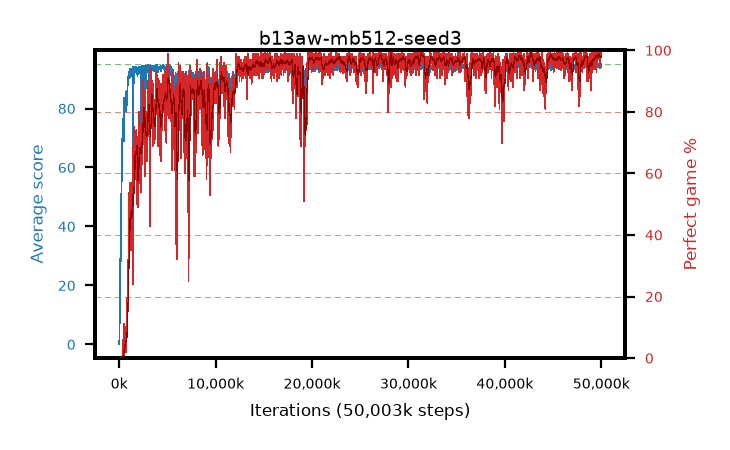

# b13aw-mb512-seed3

step **50,003,968** · 3052 evals · trailing **94.56** · peak **94.65** @31,375,360 · sef **88.5** · best30 **98.3** @31,571,968

## Config

| | |
|---|---|
| algo | ppo |
| collect_envs | 128 |
| discount | 0.99 |
| eval_interval | 16384 |
| eval_queue | True |
| eval_queue_depth | 16 |
| eval_workers | 8 |
| fc_layers | (320,) |
| graph_eval_episodes | 100 |
| max_steps | 50003968 |
| min_checkpoint_score | 40.0 |
| ppo_adam_epsilon | 1e-07 |
| ppo_anneal_fraction | 1.0 |
| ppo_clip | 0.2 |
| ppo_clip_final | None |
| ppo_entropy_coef | 0.01 |
| ppo_entropy_coef_final | None |
| ppo_epochs | 4 |
| ppo_gae_lambda | 0.99 |
| ppo_gradient_clipping | 0.5 |
| ppo_horizon | 50.3 |
| ppo_learning_rate | 0.0003 |
| ppo_learning_rate_final | None |
| ppo_minibatch | 512 |
| ppo_normalize_adv | True |
| ppo_rollout | 128 |
| ppo_target_kl | 0.0 |
| ppo_transitions_per_rollout | 16384 |
| ppo_value_loss | huber |
| ppo_vf_coef | 0.5 |
| seed | 3 |
| torch_threads | 1 |

## Evals

| step | avg score | trailing avg | min score | max score | avg reward | perfect % | epsilon |
|---|---|---|---|---|---|---|---|
| 16384 | 0.09 | 0.09 | 0.0 | 2.0 | -2.48 | 0.0 |  |
| 32768 | 1.87 | 4.49 | 1.0 | 8.0 | 1.145 | 0.0 |  |
| 49152 | 11.52 | 5.8 | 0.0 | 30.0 | 7.15 | 0.0 |  |
| ... | ... | ... | ... | ... | ... | ... | ... |
| 49823744 | 94.81 | 94.48 | 85.0 | 95.0 | 191.82 | 98.0 |  |
| 49840128 | 94.31 | 94.54 | 53.0 | 95.0 | 188.335 | 95.0 |  |
| 49856512 | 94.72 | 94.57 | 73.0 | 95.0 | 191.73 | 98.0 |  |
| 49872896 | 93.87 | 94.54 | 57.0 | 95.0 | 188.89 | 96.0 |  |
| 49889280 | 93.86 | 94.55 | 63.0 | 95.0 | 187.885 | 95.0 |  |
| 49905664 | 94.63 | 94.54 | 58.0 | 95.0 | 192.635 | 99.0 |  |
| 49922048 | 94.67 | 94.54 | 62.0 | 95.0 | 192.675 | 99.0 |  |
| 49938432 | 94.13 | 94.52 | 8.0 | 95.0 | 192.135 | 99.0 |  |
| 49954816 | 95.0 | 94.53 | 95.0 | 95.0 | 194.0 | 100.0 |  |
| 49971200 | 94.7 | 94.52 | 80.0 | 95.0 | 191.71 | 98.0 |  |
| 49987584 | 94.41 | 94.54 | 62.0 | 95.0 | 191.42 | 98.0 |  |
| 50003968 | 95.0 | 94.56 | 95.0 | 95.0 | 194.0 | 100.0 |  |
