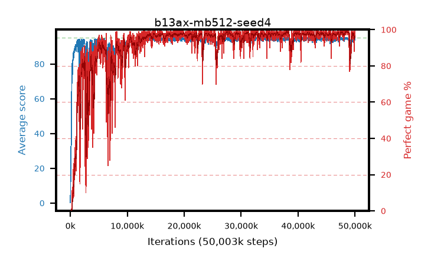

# b13ax-mb512-seed4

step **50,003,968** · 3052 evals · trailing **94.17** · peak **94.74** @48,726,016 · sef **90.4** · best30 **98.8** @48,611,328

## Config

| | |
|---|---|
| algo | ppo |
| collect_envs | 128 |
| discount | 0.99 |
| eval_interval | 16384 |
| eval_queue | True |
| eval_queue_depth | 16 |
| eval_workers | 8 |
| fc_layers | (320,) |
| graph_eval_episodes | 100 |
| max_steps | 50003968 |
| min_checkpoint_score | 40.0 |
| ppo_adam_epsilon | 1e-07 |
| ppo_anneal_fraction | 1.0 |
| ppo_clip | 0.2 |
| ppo_clip_final | None |
| ppo_entropy_coef | 0.01 |
| ppo_entropy_coef_final | None |
| ppo_epochs | 4 |
| ppo_gae_lambda | 0.99 |
| ppo_gradient_clipping | 0.5 |
| ppo_horizon | 50.3 |
| ppo_learning_rate | 0.0003 |
| ppo_learning_rate_final | None |
| ppo_minibatch | 512 |
| ppo_normalize_adv | True |
| ppo_rollout | 128 |
| ppo_target_kl | 0.0 |
| ppo_transitions_per_rollout | 16384 |
| ppo_value_loss | huber |
| ppo_vf_coef | 0.5 |
| seed | 4 |
| torch_threads | 1 |

## Evals

| step | avg score | trailing avg | min score | max score | avg reward | perfect % | epsilon |
|---|---|---|---|---|---|---|---|
| 16384 | 0.24 | 0.24 | 0.0 | 2.0 | -0.575 | 0.0 |  |
| 32768 | 8.54 | 4.39 | 2.0 | 25.0 | 3.54 | 0.0 |  |
| 49152 | 21.46 | 10.08 | 6.0 | 43.0 | 16.46 | 0.0 |  |
| ... | ... | ... | ... | ... | ... | ... | ... |
| 49823744 | 93.75 | 94.22 | 55.0 | 95.0 | 180.81 | 88.0 |  |
| 49840128 | 94.4 | 94.28 | 63.0 | 95.0 | 189.42 | 96.0 |  |
| 49856512 | 93.3 | 94.3 | 18.0 | 95.0 | 185.29 | 93.0 |  |
| 49872896 | 94.52 | 94.3 | 55.0 | 95.0 | 191.53 | 98.0 |  |
| 49889280 | 92.67 | 94.25 | 18.0 | 95.0 | 182.715 | 91.0 |  |
| 49905664 | 94.47 | 94.2 | 59.0 | 95.0 | 190.485 | 97.0 |  |
| 49922048 | 94.83 | 94.19 | 78.0 | 95.0 | 192.835 | 99.0 |  |
| 49938432 | 95.0 | 94.2 | 95.0 | 95.0 | 194.0 | 100.0 |  |
| 49954816 | 94.07 | 94.16 | 8.0 | 95.0 | 191.08 | 98.0 |  |
| 49971200 | 93.59 | 94.17 | 55.0 | 95.0 | 188.61 | 96.0 |  |
| 49987584 | 93.85 | 94.19 | 14.0 | 95.0 | 190.86 | 98.0 |  |
| 50003968 | 94.79 | 94.17 | 86.0 | 95.0 | 190.805 | 97.0 |  |
