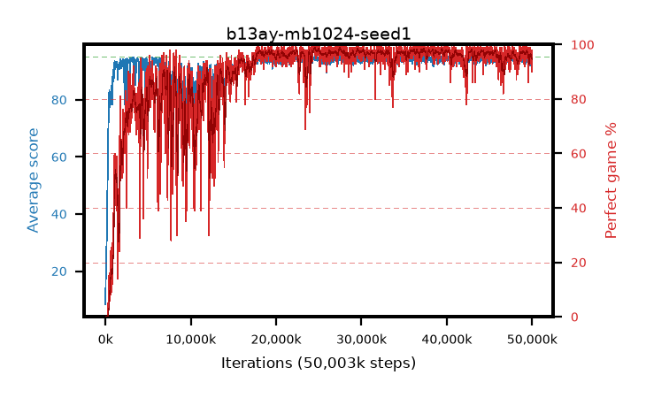

# b13ay-mb1024-seed1

step **50,003,968** · 3052 evals · trailing **93.8** · peak **94.51** @24,838,144 · sef **83.9** · best30 **98.2** @24,576,000

## Config

| | |
|---|---|
| algo | ppo |
| collect_envs | 128 |
| discount | 0.99 |
| eval_interval | 16384 |
| eval_queue | True |
| eval_queue_depth | 16 |
| eval_workers | 8 |
| fc_layers | (320,) |
| graph_eval_episodes | 100 |
| max_steps | 50003968 |
| min_checkpoint_score | 40.0 |
| ppo_adam_epsilon | 1e-07 |
| ppo_anneal_fraction | 1.0 |
| ppo_clip | 0.2 |
| ppo_clip_final | None |
| ppo_entropy_coef | 0.01 |
| ppo_entropy_coef_final | None |
| ppo_epochs | 4 |
| ppo_gae_lambda | 0.99 |
| ppo_gradient_clipping | 0.5 |
| ppo_horizon | 50.3 |
| ppo_learning_rate | 0.0003 |
| ppo_learning_rate_final | None |
| ppo_minibatch | 1024 |
| ppo_normalize_adv | True |
| ppo_rollout | 128 |
| ppo_target_kl | 0.0 |
| ppo_transitions_per_rollout | 16384 |
| ppo_value_loss | huber |
| ppo_vf_coef | 0.5 |
| seed | 1 |
| torch_threads | 1 |

## Evals

| step | avg score | trailing avg | min score | max score | avg reward | perfect % | epsilon |
|---|---|---|---|---|---|---|---|
| 16384 | 8.36 | 16.44 | 1.0 | 28.0 | 6.33 | 0.0 |  |
| 32768 | 17.85 | 17.85 | 5.0 | 35.0 | 12.85 | 0.0 |  |
| 49152 | 17.22 | 17.54 | 3.0 | 34.0 | 12.22 | 0.0 |  |
| ... | ... | ... | ... | ... | ... | ... | ... |
| 49823744 | 93.2 | 93.94 | 22.0 | 95.0 | 189.215 | 97.0 |  |
| 49840128 | 94.68 | 93.83 | 66.0 | 95.0 | 191.69 | 98.0 |  |
| 49856512 | 94.18 | 93.79 | 57.0 | 95.0 | 190.195 | 97.0 |  |
| 49872896 | 92.73 | 93.52 | 24.0 | 95.0 | 184.765 | 93.0 |  |
| 49889280 | 94.18 | 93.54 | 70.0 | 95.0 | 187.21 | 94.0 |  |
| 49905664 | 94.25 | 93.52 | 68.0 | 95.0 | 187.28 | 94.0 |  |
| 49922048 | 94.71 | 93.82 | 80.0 | 95.0 | 190.725 | 97.0 |  |
| 49938432 | 91.84 | 93.7 | 8.0 | 95.0 | 184.87 | 94.0 |  |
| 49954816 | 93.43 | 93.67 | 20.0 | 95.0 | 185.465 | 93.0 |  |
| 49971200 | 92.54 | 93.76 | 12.0 | 95.0 | 181.59 | 90.0 |  |
| 49987584 | 94.29 | 93.83 | 59.0 | 95.0 | 191.3 | 98.0 |  |
| 50003968 | 93.3 | 93.8 | 12.0 | 95.0 | 187.325 | 95.0 |  |
