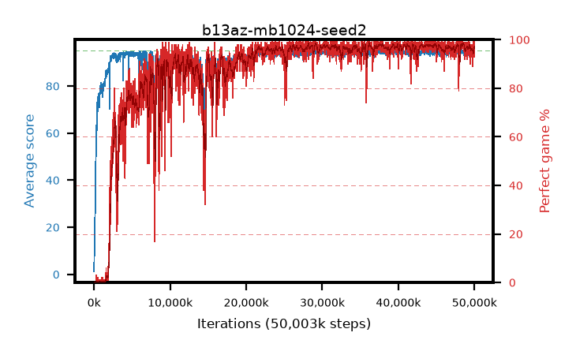

# b13az-mb1024-seed2

step **50,003,968** · 3052 evals · trailing **93.99** · peak **94.57** @48,545,792 · sef **82.7** · best30 **98.1** @48,562,176

## Config

| | |
|---|---|
| algo | ppo |
| collect_envs | 128 |
| discount | 0.99 |
| eval_interval | 16384 |
| eval_queue | True |
| eval_queue_depth | 16 |
| eval_workers | 8 |
| fc_layers | (320,) |
| graph_eval_episodes | 100 |
| max_steps | 50003968 |
| min_checkpoint_score | 40.0 |
| ppo_adam_epsilon | 1e-07 |
| ppo_anneal_fraction | 1.0 |
| ppo_clip | 0.2 |
| ppo_clip_final | None |
| ppo_entropy_coef | 0.01 |
| ppo_entropy_coef_final | None |
| ppo_epochs | 4 |
| ppo_gae_lambda | 0.99 |
| ppo_gradient_clipping | 0.5 |
| ppo_horizon | 50.3 |
| ppo_learning_rate | 0.0003 |
| ppo_learning_rate_final | None |
| ppo_minibatch | 1024 |
| ppo_normalize_adv | True |
| ppo_rollout | 128 |
| ppo_target_kl | 0.0 |
| ppo_transitions_per_rollout | 16384 |
| ppo_value_loss | huber |
| ppo_vf_coef | 0.5 |
| seed | 2 |
| torch_threads | 1 |

## Evals

| step | avg score | trailing avg | min score | max score | avg reward | perfect % | epsilon |
|---|---|---|---|---|---|---|---|
| 16384 | 1.23 | 1.23 | 0.0 | 5.0 | -0.26 | 0.0 |  |
| 32768 | 7.56 | 4.39 | 2.0 | 15.0 | 2.56 | 0.0 |  |
| 49152 | 8.1 | 5.63 | 2.0 | 20.0 | 3.1 | 0.0 |  |
| ... | ... | ... | ... | ... | ... | ... | ... |
| 49823744 | 94.03 | 93.93 | 55.0 | 95.0 | 188.055 | 95.0 |  |
| 49840128 | 94.54 | 94.2 | 49.0 | 95.0 | 192.545 | 99.0 |  |
| 49856512 | 93.92 | 93.94 | 14.0 | 95.0 | 188.94 | 96.0 |  |
| 49872896 | 94.2 | 94.11 | 63.0 | 95.0 | 188.225 | 95.0 |  |
| 49889280 | 94.83 | 94.18 | 85.0 | 95.0 | 190.845 | 97.0 |  |
| 49905664 | 95.0 | 94.02 | 95.0 | 95.0 | 194.0 | 100.0 |  |
| 49922048 | 94.8 | 94.05 | 75.0 | 95.0 | 192.805 | 99.0 |  |
| 49938432 | 93.79 | 94.19 | 34.0 | 95.0 | 185.78 | 93.0 |  |
| 49954816 | 94.32 | 94.11 | 59.0 | 95.0 | 189.34 | 96.0 |  |
| 49971200 | 95.0 | 94.0 | 95.0 | 95.0 | 194.0 | 100.0 |  |
| 49987584 | 94.26 | 93.99 | 69.0 | 95.0 | 190.275 | 97.0 |  |
| 50003968 | 94.71 | 93.99 | 77.0 | 95.0 | 191.72 | 98.0 |  |
