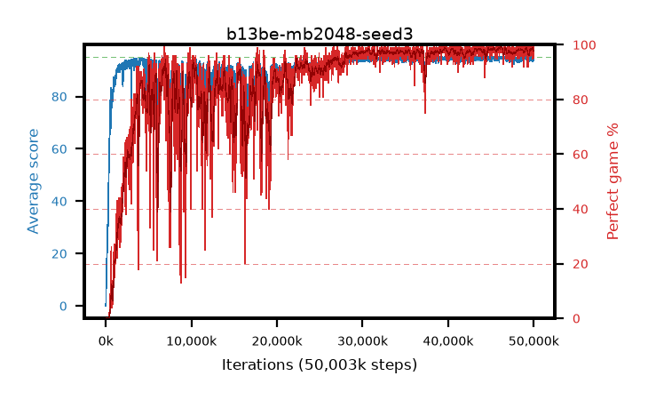

# b13be-mb2048-seed3

step **50,003,968** · 3052 evals · trailing **94.52** · peak **94.7** @46,219,264 · sef **79.7** · best30 **99.0** @46,301,184

## Config

| | |
|---|---|
| algo | ppo |
| collect_envs | 128 |
| discount | 0.99 |
| eval_interval | 16384 |
| eval_queue | True |
| eval_queue_depth | 16 |
| eval_workers | 8 |
| fc_layers | (320,) |
| graph_eval_episodes | 100 |
| max_steps | 50003968 |
| min_checkpoint_score | 40.0 |
| ppo_adam_epsilon | 1e-07 |
| ppo_anneal_fraction | 1.0 |
| ppo_clip | 0.2 |
| ppo_clip_final | None |
| ppo_entropy_coef | 0.01 |
| ppo_entropy_coef_final | None |
| ppo_epochs | 4 |
| ppo_gae_lambda | 0.99 |
| ppo_gradient_clipping | 0.5 |
| ppo_horizon | 50.3 |
| ppo_learning_rate | 0.0003 |
| ppo_learning_rate_final | None |
| ppo_minibatch | 2048 |
| ppo_normalize_adv | True |
| ppo_rollout | 128 |
| ppo_target_kl | 0.0 |
| ppo_transitions_per_rollout | 16384 |
| ppo_value_loss | huber |
| ppo_vf_coef | 0.5 |
| seed | 3 |
| torch_threads | 1 |

## Evals

| step | avg score | trailing avg | min score | max score | avg reward | perfect % | epsilon |
|---|---|---|---|---|---|---|---|
| 16384 | 0.01 | 0.01 | 0.0 | 1.0 | -3.01 | 0.0 |  |
| 32768 | 1.24 | 0.62 | 0.0 | 3.0 | 0.245 | 0.0 |  |
| 49152 | 9.4 | 5.47 | 2.0 | 18.0 | 4.49 | 0.0 |  |
| ... | ... | ... | ... | ... | ... | ... | ... |
| 49823744 | 94.16 | 94.52 | 55.0 | 95.0 | 190.175 | 97.0 |  |
| 49840128 | 95.0 | 94.54 | 95.0 | 95.0 | 194.0 | 100.0 |  |
| 49856512 | 94.69 | 94.54 | 64.0 | 95.0 | 192.695 | 99.0 |  |
| 49872896 | 93.44 | 94.51 | 56.0 | 95.0 | 187.465 | 95.0 |  |
| 49889280 | 94.6 | 94.53 | 62.0 | 95.0 | 191.565 | 98.0 |  |
| 49905664 | 93.99 | 94.51 | 56.0 | 95.0 | 190.005 | 97.0 |  |
| 49922048 | 94.65 | 94.54 | 60.0 | 95.0 | 192.655 | 99.0 |  |
| 49938432 | 93.65 | 94.5 | 20.0 | 95.0 | 187.63 | 95.0 |  |
| 49954816 | 95.0 | 94.54 | 95.0 | 95.0 | 194.0 | 100.0 |  |
| 49971200 | 94.75 | 94.49 | 70.0 | 95.0 | 192.755 | 99.0 |  |
| 49987584 | 94.54 | 94.49 | 56.0 | 95.0 | 191.55 | 98.0 |  |
| 50003968 | 94.29 | 94.52 | 56.0 | 95.0 | 191.3 | 98.0 |  |
