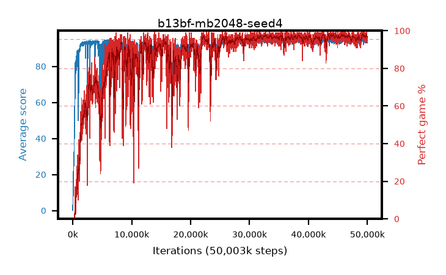

# b13bf-mb2048-seed4

step **50,003,968** · 3052 evals · trailing **94.08** · peak **94.36** @44,236,800 · sef **81.7** · best30 **97.8** @45,973,504

## Config

| | |
|---|---|
| algo | ppo |
| collect_envs | 128 |
| discount | 0.99 |
| eval_interval | 16384 |
| eval_queue | True |
| eval_queue_depth | 16 |
| eval_workers | 8 |
| fc_layers | (320,) |
| graph_eval_episodes | 100 |
| max_steps | 50003968 |
| min_checkpoint_score | 40.0 |
| ppo_adam_epsilon | 1e-07 |
| ppo_anneal_fraction | 1.0 |
| ppo_clip | 0.2 |
| ppo_clip_final | None |
| ppo_entropy_coef | 0.01 |
| ppo_entropy_coef_final | None |
| ppo_epochs | 4 |
| ppo_gae_lambda | 0.99 |
| ppo_gradient_clipping | 0.5 |
| ppo_horizon | 50.3 |
| ppo_learning_rate | 0.0003 |
| ppo_learning_rate_final | None |
| ppo_minibatch | 2048 |
| ppo_normalize_adv | True |
| ppo_rollout | 128 |
| ppo_target_kl | 0.0 |
| ppo_transitions_per_rollout | 16384 |
| ppo_value_loss | huber |
| ppo_vf_coef | 0.5 |
| seed | 4 |
| torch_threads | 1 |

## Evals

| step | avg score | trailing avg | min score | max score | avg reward | perfect % | epsilon |
|---|---|---|---|---|---|---|---|
| 16384 | 0.16 | 0.16 | 0.0 | 2.0 | -0.43 | 0.0 |  |
| 32768 | 5.83 | 3.0 | 2.0 | 13.0 | 0.83 | 0.0 |  |
| 49152 | 13.49 | 11.09 | 2.0 | 27.0 | 8.49 | 0.0 |  |
| ... | ... | ... | ... | ... | ... | ... | ... |
| 49823744 | 94.57 | 94.17 | 55.0 | 95.0 | 191.58 | 98.0 |  |
| 49840128 | 95.0 | 94.09 | 95.0 | 95.0 | 194.0 | 100.0 |  |
| 49856512 | 94.13 | 94.23 | 55.0 | 95.0 | 187.16 | 94.0 |  |
| 49872896 | 94.61 | 94.15 | 56.0 | 95.0 | 192.615 | 99.0 |  |
| 49889280 | 94.81 | 94.22 | 76.0 | 95.0 | 192.815 | 99.0 |  |
| 49905664 | 93.69 | 94.18 | 49.0 | 95.0 | 186.72 | 94.0 |  |
| 49922048 | 93.35 | 94.16 | 22.0 | 95.0 | 188.37 | 96.0 |  |
| 49938432 | 94.36 | 94.14 | 64.0 | 95.0 | 189.38 | 96.0 |  |
| 49954816 | 94.11 | 94.1 | 50.0 | 95.0 | 190.125 | 97.0 |  |
| 49971200 | 94.2 | 94.08 | 57.0 | 95.0 | 190.17 | 97.0 |  |
| 49987584 | 93.38 | 94.07 | 52.0 | 95.0 | 187.405 | 95.0 |  |
| 50003968 | 92.92 | 94.08 | 20.0 | 95.0 | 187.895 | 96.0 |  |
