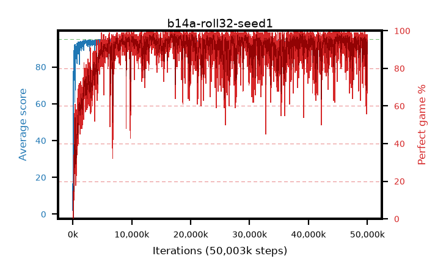

# b14a-roll32-seed1

step **50,003,968** · 12208 evals · trailing **92.48** · peak **94.7** @16,908,288 · sef **86.0** · best30 **97.9** @16,830,464

## Config

| | |
|---|---|
| algo | ppo |
| collect_envs | 128 |
| discount | 0.99 |
| eval_interval | 4096 |
| eval_queue | True |
| eval_queue_depth | 16 |
| eval_workers | 8 |
| fc_layers | (320,) |
| graph_eval_episodes | 100 |
| max_steps | 50003968 |
| min_checkpoint_score | 40.0 |
| ppo_adam_epsilon | 1e-07 |
| ppo_anneal_fraction | 1.0 |
| ppo_clip | 0.2 |
| ppo_clip_final | None |
| ppo_entropy_coef | 0.01 |
| ppo_entropy_coef_final | None |
| ppo_epochs | 4 |
| ppo_gae_lambda | 0.99 |
| ppo_gradient_clipping | 0.5 |
| ppo_horizon | 50.3 |
| ppo_learning_rate | 0.0003 |
| ppo_learning_rate_final | None |
| ppo_minibatch | 256 |
| ppo_normalize_adv | True |
| ppo_rollout | 32 |
| ppo_target_kl | 0.0 |
| ppo_transitions_per_rollout | 4096 |
| ppo_value_loss | huber |
| ppo_vf_coef | 0.5 |
| seed | 1 |
| torch_threads | 1 |

## Evals

| step | avg score | trailing avg | min score | max score | avg reward | perfect % | epsilon |
|---|---|---|---|---|---|---|---|
| 4096 | 2.11 | 2.11 | 0.0 | 5.0 | -0.955 | 0.0 |  |
| 8192 | 12.9 | 18.83 | 2.0 | 35.0 | 7.9 | 0.0 |  |
| 12288 | 18.81 | 10.46 | 2.0 | 39.0 | 13.81 | 0.0 |  |
| ... | ... | ... | ... | ... | ... | ... | ... |
| 49958912 | 92.03 | 91.48 | 26.0 | 95.0 | 180.04 | 89.0 |  |
| 49963008 | 93.52 | 92.67 | 58.0 | 95.0 | 186.55 | 94.0 |  |
| 49967104 | 94.54 | 92.47 | 65.0 | 95.0 | 191.55 | 98.0 |  |
| 49971200 | 94.37 | 92.14 | 74.0 | 95.0 | 187.4 | 94.0 |  |
| 49975296 | 94.35 | 92.74 | 69.0 | 95.0 | 188.375 | 95.0 |  |
| 49979392 | 94.11 | 92.67 | 20.0 | 95.0 | 190.125 | 97.0 |  |
| 49983488 | 94.3 | 91.61 | 65.0 | 95.0 | 189.32 | 96.0 |  |
| 49987584 | 94.35 | 91.87 | 54.0 | 95.0 | 190.32 | 97.0 |  |
| 49991680 | 94.26 | 92.29 | 66.0 | 95.0 | 189.28 | 96.0 |  |
| 49995776 | 89.11 | 92.41 | 65.0 | 95.0 | 155.275 | 67.0 |  |
| 49999872 | 93.87 | 92.54 | 59.0 | 95.0 | 184.865 | 92.0 |  |
| 50003968 | 93.62 | 92.48 | 71.0 | 95.0 | 179.64 | 87.0 |  |
