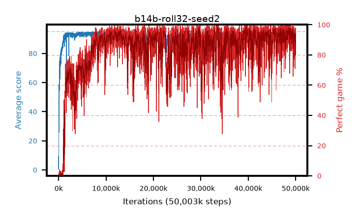

# b14b-roll32-seed2

step **50,003,968** · 12208 evals · trailing **93.07** · peak **94.54** @29,822,976 · sef **73.1** · best30 **98.0** @33,447,936

## Config

| | |
|---|---|
| algo | ppo |
| collect_envs | 128 |
| discount | 0.99 |
| eval_interval | 4096 |
| eval_queue | True |
| eval_queue_depth | 16 |
| eval_workers | 8 |
| fc_layers | (320,) |
| graph_eval_episodes | 100 |
| max_steps | 50003968 |
| min_checkpoint_score | 40.0 |
| ppo_adam_epsilon | 1e-07 |
| ppo_anneal_fraction | 1.0 |
| ppo_clip | 0.2 |
| ppo_clip_final | None |
| ppo_entropy_coef | 0.01 |
| ppo_entropy_coef_final | None |
| ppo_epochs | 4 |
| ppo_gae_lambda | 0.99 |
| ppo_gradient_clipping | 0.5 |
| ppo_horizon | 50.3 |
| ppo_learning_rate | 0.0003 |
| ppo_learning_rate_final | None |
| ppo_minibatch | 256 |
| ppo_normalize_adv | True |
| ppo_rollout | 32 |
| ppo_target_kl | 0.0 |
| ppo_transitions_per_rollout | 4096 |
| ppo_value_loss | huber |
| ppo_vf_coef | 0.5 |
| seed | 2 |
| torch_threads | 1 |

## Evals

| step | avg score | trailing avg | min score | max score | avg reward | perfect % | epsilon |
|---|---|---|---|---|---|---|---|
| 4096 | 0.63 | 0.63 | 0.0 | 4.0 | -0.41 | 0.0 |  |
| 8192 | 5.85 | 5.23 | 0.0 | 15.0 | 1.93 | 0.0 |  |
| 12288 | 8.91 | 7.23 | 2.0 | 20.0 | 3.91 | 0.0 |  |
| ... | ... | ... | ... | ... | ... | ... | ... |
| 49958912 | 94.42 | 92.61 | 76.0 | 95.0 | 187.405 | 94.0 |  |
| 49963008 | 93.1 | 92.13 | 60.0 | 95.0 | 182.105 | 90.0 |  |
| 49967104 | 92.33 | 92.18 | 63.0 | 95.0 | 171.43 | 80.0 |  |
| 49971200 | 93.25 | 92.42 | 60.0 | 95.0 | 178.32 | 86.0 |  |
| 49975296 | 92.19 | 92.24 | 30.0 | 95.0 | 178.21 | 87.0 |  |
| 49979392 | 93.41 | 92.74 | 65.0 | 95.0 | 181.42 | 89.0 |  |
| 49983488 | 92.31 | 92.29 | 14.0 | 95.0 | 177.335 | 86.0 |  |
| 49987584 | 94.21 | 92.85 | 68.0 | 95.0 | 185.16 | 92.0 |  |
| 49991680 | 93.02 | 92.74 | 62.0 | 95.0 | 175.015 | 83.0 |  |
| 49995776 | 94.83 | 93.22 | 88.0 | 95.0 | 189.85 | 96.0 |  |
| 49999872 | 93.94 | 92.96 | 46.0 | 95.0 | 184.935 | 92.0 |  |
| 50003968 | 94.83 | 93.07 | 88.0 | 95.0 | 190.8 | 97.0 |  |
