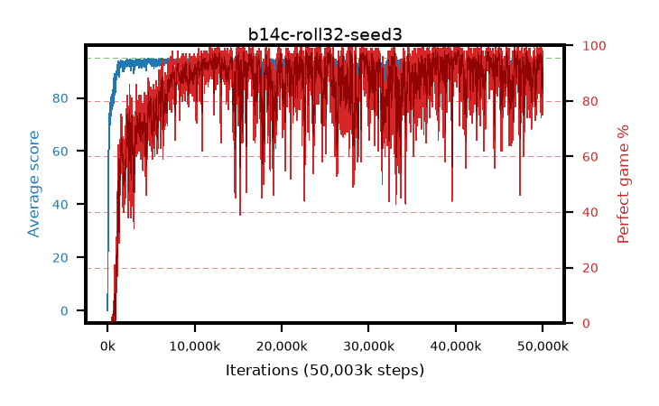

# b14c-roll32-seed3

step **50,003,968** · 12208 evals · trailing **92.09** · peak **94.53** @39,911,424 · sef **75.7** · best30 **97.5** @40,333,312

## Config

| | |
|---|---|
| algo | ppo |
| collect_envs | 128 |
| discount | 0.99 |
| eval_interval | 4096 |
| eval_queue | True |
| eval_queue_depth | 16 |
| eval_workers | 8 |
| fc_layers | (320,) |
| graph_eval_episodes | 100 |
| max_steps | 50003968 |
| min_checkpoint_score | 40.0 |
| ppo_adam_epsilon | 1e-07 |
| ppo_anneal_fraction | 1.0 |
| ppo_clip | 0.2 |
| ppo_clip_final | None |
| ppo_entropy_coef | 0.01 |
| ppo_entropy_coef_final | None |
| ppo_epochs | 4 |
| ppo_gae_lambda | 0.99 |
| ppo_gradient_clipping | 0.5 |
| ppo_horizon | 50.3 |
| ppo_learning_rate | 0.0003 |
| ppo_learning_rate_final | None |
| ppo_minibatch | 256 |
| ppo_normalize_adv | True |
| ppo_rollout | 32 |
| ppo_target_kl | 0.0 |
| ppo_transitions_per_rollout | 4096 |
| ppo_value_loss | huber |
| ppo_vf_coef | 0.5 |
| seed | 3 |
| torch_threads | 1 |

## Evals

| step | avg score | trailing avg | min score | max score | avg reward | perfect % | epsilon |
|---|---|---|---|---|---|---|---|
| 4096 | 0.06 | 0.06 | 0.0 | 1.0 | -3.815 | 0.0 |  |
| 8192 | 1.41 | 0.73 | 0.0 | 10.0 | 0.73 | 0.0 |  |
| 12288 | 7.12 | 10.19 | 0.0 | 22.0 | 3.92 | 0.0 |  |
| ... | ... | ... | ... | ... | ... | ... | ... |
| 49958912 | 90.79 | 93.51 | 3.0 | 95.0 | 173.87 | 84.0 |  |
| 49963008 | 88.04 | 93.2 | 7.0 | 95.0 | 162.165 | 75.0 |  |
| 49967104 | 90.29 | 92.46 | 56.0 | 95.0 | 170.385 | 81.0 |  |
| 49971200 | 91.69 | 93.15 | 49.0 | 95.0 | 177.755 | 87.0 |  |
| 49975296 | 89.76 | 92.91 | 52.0 | 95.0 | 164.88 | 76.0 |  |
| 49979392 | 91.49 | 93.04 | 3.0 | 95.0 | 179.545 | 89.0 |  |
| 49983488 | 92.12 | 92.56 | 40.0 | 95.0 | 179.18 | 88.0 |  |
| 49987584 | 90.85 | 92.79 | 18.0 | 95.0 | 174.925 | 85.0 |  |
| 49991680 | 89.75 | 92.64 | 5.0 | 95.0 | 171.835 | 83.0 |  |
| 49995776 | 89.26 | 92.28 | 3.0 | 95.0 | 169.355 | 81.0 |  |
| 49999872 | 90.49 | 92.17 | 20.0 | 95.0 | 176.555 | 87.0 |  |
| 50003968 | 92.14 | 92.09 | 57.0 | 95.0 | 179.2 | 88.0 |  |
