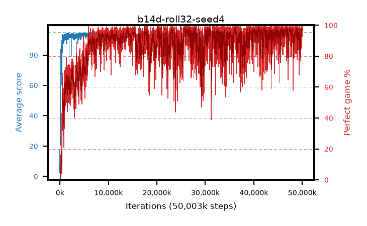

# b14d-roll32-seed4

step **50,003,968** · 12208 evals · trailing **94.45** · peak **94.55** @46,538,752 · sef **80.3** · best30 **98.1** @25,645,056

## Config

| | |
|---|---|
| algo | ppo |
| collect_envs | 128 |
| discount | 0.99 |
| eval_interval | 4096 |
| eval_queue | True |
| eval_queue_depth | 16 |
| eval_workers | 8 |
| fc_layers | (320,) |
| graph_eval_episodes | 100 |
| max_steps | 50003968 |
| min_checkpoint_score | 40.0 |
| ppo_adam_epsilon | 1e-07 |
| ppo_anneal_fraction | 1.0 |
| ppo_clip | 0.2 |
| ppo_clip_final | None |
| ppo_entropy_coef | 0.01 |
| ppo_entropy_coef_final | None |
| ppo_epochs | 4 |
| ppo_gae_lambda | 0.99 |
| ppo_gradient_clipping | 0.5 |
| ppo_horizon | 50.3 |
| ppo_learning_rate | 0.0003 |
| ppo_learning_rate_final | None |
| ppo_minibatch | 256 |
| ppo_normalize_adv | True |
| ppo_rollout | 32 |
| ppo_target_kl | 0.0 |
| ppo_transitions_per_rollout | 4096 |
| ppo_value_loss | huber |
| ppo_vf_coef | 0.5 |
| seed | 4 |
| torch_threads | 1 |

## Evals

| step | avg score | trailing avg | min score | max score | avg reward | perfect % | epsilon |
|---|---|---|---|---|---|---|---|
| 4096 | 2.37 | 8.86 | 0.0 | 12.0 | 1.465 | 0.0 |  |
| 8192 | 17.52 | 13.96 | 4.0 | 31.0 | 12.52 | 0.0 |  |
| 12288 | 16.08 | 14.26 | 4.0 | 38.0 | 11.08 | 0.0 |  |
| ... | ... | ... | ... | ... | ... | ... | ... |
| 49958912 | 93.85 | 94.38 | 10.0 | 95.0 | 189.865 | 97.0 |  |
| 49963008 | 94.33 | 94.37 | 70.0 | 95.0 | 189.35 | 96.0 |  |
| 49967104 | 94.38 | 94.4 | 58.0 | 95.0 | 191.39 | 98.0 |  |
| 49971200 | 94.48 | 94.38 | 63.0 | 95.0 | 188.505 | 95.0 |  |
| 49975296 | 95.0 | 94.38 | 95.0 | 95.0 | 194.0 | 100.0 |  |
| 49979392 | 94.52 | 94.41 | 65.0 | 95.0 | 191.53 | 98.0 |  |
| 49983488 | 94.22 | 94.4 | 30.0 | 95.0 | 189.24 | 96.0 |  |
| 49987584 | 95.0 | 94.39 | 95.0 | 95.0 | 194.0 | 100.0 |  |
| 49991680 | 94.58 | 94.48 | 64.0 | 95.0 | 190.595 | 97.0 |  |
| 49995776 | 94.66 | 94.49 | 61.0 | 95.0 | 192.665 | 99.0 |  |
| 49999872 | 93.99 | 94.47 | 52.0 | 95.0 | 189.01 | 96.0 |  |
| 50003968 | 94.06 | 94.45 | 8.0 | 95.0 | 191.07 | 98.0 |  |
