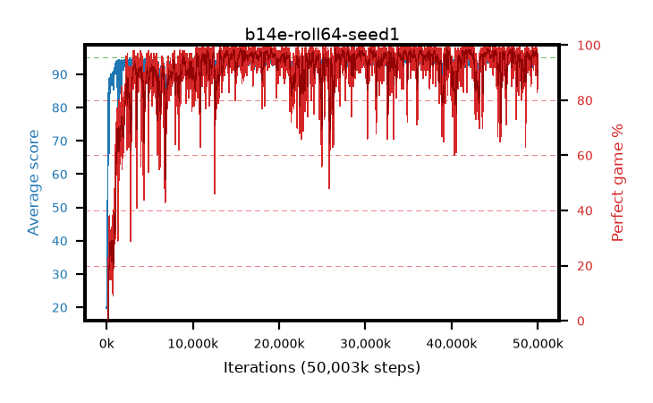

# b14e-roll64-seed1

step **50,003,968** · 6104 evals · trailing **94.27** · peak **94.59** @46,866,432 · sef **90.5** · best30 **98.1** @44,318,720

## Config

| | |
|---|---|
| algo | ppo |
| collect_envs | 128 |
| discount | 0.99 |
| eval_interval | 8192 |
| eval_queue | True |
| eval_queue_depth | 16 |
| eval_workers | 8 |
| fc_layers | (320,) |
| graph_eval_episodes | 100 |
| max_steps | 50003968 |
| min_checkpoint_score | 40.0 |
| ppo_adam_epsilon | 1e-07 |
| ppo_anneal_fraction | 1.0 |
| ppo_clip | 0.2 |
| ppo_clip_final | None |
| ppo_entropy_coef | 0.01 |
| ppo_entropy_coef_final | None |
| ppo_epochs | 4 |
| ppo_gae_lambda | 0.99 |
| ppo_gradient_clipping | 0.5 |
| ppo_horizon | 50.3 |
| ppo_learning_rate | 0.0003 |
| ppo_learning_rate_final | None |
| ppo_minibatch | 256 |
| ppo_normalize_adv | True |
| ppo_rollout | 64 |
| ppo_target_kl | 0.0 |
| ppo_transitions_per_rollout | 8192 |
| ppo_value_loss | huber |
| ppo_vf_coef | 0.5 |
| seed | 1 |
| torch_threads | 1 |

## Evals

| step | avg score | trailing avg | min score | max score | avg reward | perfect % | epsilon |
|---|---|---|---|---|---|---|---|
| 8192 | 19.99 | 21.24 | 5.0 | 34.0 | 14.99 | 0.0 |  |
| 16384 | 19.76 | 19.76 | 3.0 | 37.0 | 14.805 | 0.0 |  |
| 24576 | 19.83 | 19.8 | 1.0 | 35.0 | 14.875 | 0.0 |  |
| ... | ... | ... | ... | ... | ... | ... | ... |
| 49913856 | 93.78 | 94.27 | 73.0 | 95.0 | 182.83 | 90.0 |  |
| 49922048 | 92.53 | 94.19 | 71.0 | 95.0 | 174.57 | 83.0 |  |
| 49930240 | 92.62 | 94.11 | 28.0 | 95.0 | 178.685 | 87.0 |  |
| 49938432 | 93.28 | 94.06 | 73.0 | 95.0 | 181.335 | 89.0 |  |
| 49946624 | 91.89 | 94.0 | 30.0 | 95.0 | 174.925 | 84.0 |  |
| 49954816 | 92.35 | 93.95 | 12.0 | 95.0 | 182.35 | 91.0 |  |
| 49963008 | 93.73 | 93.93 | 73.0 | 95.0 | 183.775 | 91.0 |  |
| 49971200 | 93.65 | 93.96 | 79.0 | 95.0 | 180.665 | 88.0 |  |
| 49979392 | 94.06 | 94.36 | 71.0 | 95.0 | 186.095 | 93.0 |  |
| 49987584 | 93.45 | 94.33 | 24.0 | 95.0 | 184.49 | 92.0 |  |
| 49995776 | 94.2 | 94.3 | 66.0 | 95.0 | 189.175 | 96.0 |  |
| 50003968 | 94.31 | 94.27 | 58.0 | 95.0 | 190.325 | 97.0 |  |
