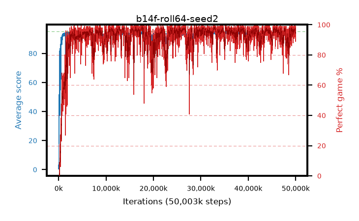

# b14f-roll64-seed2

step **50,003,968** · 6104 evals · trailing **94.24** · peak **94.61** @38,961,152 · sef **92.0** · best30 **98.3** @17,596,416

## Config

| | |
|---|---|
| algo | ppo |
| collect_envs | 128 |
| discount | 0.99 |
| eval_interval | 8192 |
| eval_queue | True |
| eval_queue_depth | 16 |
| eval_workers | 8 |
| fc_layers | (320,) |
| graph_eval_episodes | 100 |
| max_steps | 50003968 |
| min_checkpoint_score | 40.0 |
| ppo_adam_epsilon | 1e-07 |
| ppo_anneal_fraction | 1.0 |
| ppo_clip | 0.2 |
| ppo_clip_final | None |
| ppo_entropy_coef | 0.01 |
| ppo_entropy_coef_final | None |
| ppo_epochs | 4 |
| ppo_gae_lambda | 0.99 |
| ppo_gradient_clipping | 0.5 |
| ppo_horizon | 50.3 |
| ppo_learning_rate | 0.0003 |
| ppo_learning_rate_final | None |
| ppo_minibatch | 256 |
| ppo_normalize_adv | True |
| ppo_rollout | 64 |
| ppo_target_kl | 0.0 |
| ppo_transitions_per_rollout | 8192 |
| ppo_value_loss | huber |
| ppo_vf_coef | 0.5 |
| seed | 2 |
| torch_threads | 1 |

## Evals

| step | avg score | trailing avg | min score | max score | avg reward | perfect % | epsilon |
|---|---|---|---|---|---|---|---|
| 8192 | 0.4 | 0.4 | 0.0 | 3.0 | -0.145 | 0.0 |  |
| 16384 | 1.96 | 1.18 | 1.0 | 5.0 | -0.115 | 0.0 |  |
| 24576 | 13.94 | 5.43 | 3.0 | 38.0 | 8.94 | 0.0 |  |
| ... | ... | ... | ... | ... | ... | ... | ... |
| 49913856 | 94.03 | 94.28 | 17.0 | 95.0 | 190.0 | 97.0 |  |
| 49922048 | 92.8 | 94.25 | 23.0 | 95.0 | 181.76 | 90.0 |  |
| 49930240 | 93.13 | 94.19 | 22.0 | 95.0 | 184.17 | 92.0 |  |
| 49938432 | 93.13 | 94.23 | 25.0 | 95.0 | 181.14 | 89.0 |  |
| 49946624 | 94.33 | 94.24 | 67.0 | 95.0 | 189.35 | 96.0 |  |
| 49954816 | 94.87 | 94.18 | 82.0 | 95.0 | 192.875 | 99.0 |  |
| 49963008 | 93.77 | 94.15 | 34.0 | 95.0 | 187.795 | 95.0 |  |
| 49971200 | 94.35 | 94.21 | 65.0 | 95.0 | 190.365 | 97.0 |  |
| 49979392 | 93.87 | 94.18 | 53.0 | 95.0 | 187.895 | 95.0 |  |
| 49987584 | 94.63 | 94.23 | 71.0 | 95.0 | 190.645 | 97.0 |  |
| 49995776 | 93.35 | 94.29 | 14.0 | 95.0 | 184.39 | 92.0 |  |
| 50003968 | 94.09 | 94.24 | 66.0 | 95.0 | 188.115 | 95.0 |  |
